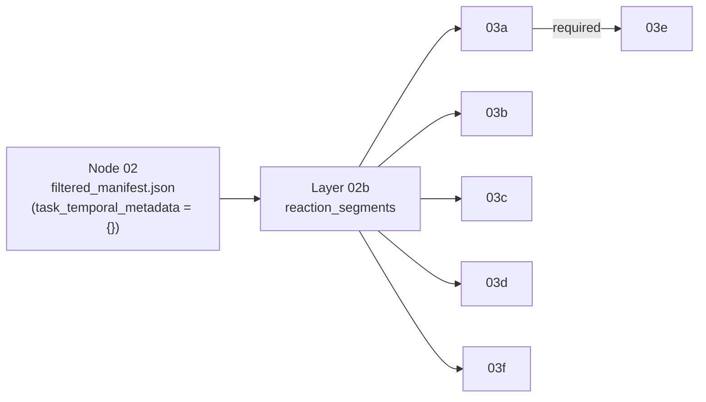

# Layer 02b: Task Climax / Reaction Segments

## Objective
Annotate the Node-02 `filtered_manifest.json` with **bystander-anchored reaction segments**: for every `identified_task`, fill `task_temporal_metadata` with the list of social-moment windows that every downstream Layer 03 pipeline samples. This is the stage that decides *when* in a (median ~26-minute) task range the pipeline looks for bystander reactions — the quality of every downstream affective signal is bounded by it.

**Position in the pipeline**: after Node 02 (which emits `task_temporal_metadata = {}` — docs/02 Resolved #8), before every Layer 03x. Implementation: `src/layer_02b_task_climax/pipeline.py`.



## Running it
```bash
# Production pre-pass (parallel, checkpointed, resumable; annotates in place):
cd src && python -m layer_02b_task_climax.pipeline <filtered_manifest.json> --workers 8

# Pure manifest pass (no video decode at all — skips BlazeFace verification):
python -m layer_02b_task_climax.pipeline <manifest.json> --no-face-verify
```
Measured cost (June 30, M4 Max, 8 production clips / 281 segments): **0.8 s total** manifest-only; **34 s total** (~4 s/clip) with face verification at `--workers 4`. The retired optical-flow detector was the *dominant* per-clip cost of every Layer 03 run (projected ~14 days full-corpus before its own optimizations; hours after them).

Back-compat: a Layer 03 run on an un-annotated manifest still works — `shared.climax_extraction.populate_climax_for_manifest()` now delegates here lazily (03b calls it with the face-quality `entry_filter`). The supported production path is running 02b explicitly first; the layers then find the metadata cached.

## Algorithm (bbox-kernel climax, June 30)

1. **Cluster** each task's bystander detections in time — unchanged from the June 23 multi-window rework (docs/02 Resolved #22): a new cluster starts where bystanders are absent > `CLIMAX_CLUSTER_GAP_SEC = 15 s` or a running span exceeds `CLIMAX_MAX_CLUSTER_SPAN_SEC = 90 s`; singleton clusters are dropped; the densest `CLIMAX_MAX_SEGMENTS = 10` are kept. One reaction segment per cluster.
2. **Climax = the detection timestamp maximizing Gaussian-kernel-weighted bbox height** within the cluster (`KERNEL_SIGMA_SEC = 1 s`, support ±2 s). Tall boxes = close bystanders = resolvable faces; the kernel rewards *sustained* proximity over a single-frame spike. Because the climax **is** a detection timestamp, the downstream re-anchoring helper (`shared/bystander_window.py`) is satisfied by construction. Needs **zero video decode**.
3. **Straddle window**: `task_reaction_window_sec = [climax − 1 s, climax + 3 s]`, **shifted (not clipped)** at clip edges so no degenerate `[d, d]` windows exist. (The flow-era trailing window `[climax+1, climax+3]` assumed "reaction follows wearer action"; that inverted whenever the flow peak was the wearer turning *away*.)
4. **Face verification** (`SR_02B_FACE_VERIFY`, default on): decode one frame for each of the top-3 kernel candidates, run BlazeFace (the shared `models/mediapipe/blaze_face_short_range.tflite`, same as 03a/03b and the face-quality prefilter) on the tallest nearby bystander crop, and pick the candidate with the largest resolvable face. This closes the kernel's one blind spot — proximity-aware but **orientation-blind** (a close bystander facing away) — for ~3 frame decodes per segment. The winning face height is recorded as `segment_face_px` (`0` when no candidate showed a face), giving downstream layers a free per-segment quality gate.

### Per-segment schema (additive to docs/02's contract)
```json
{
  "task_climax_sec": 1080.1,
  "task_reaction_window_sec": [1079.1, 1083.1],
  "climax_extraction_method": "bbox_kernel_peak+face_verified",
  "bbox_kernel_score": 1834.2,
  "segment_face_px": 199,
  "segment_face_conf": 0.94,
  "bystander_cluster_sec": [1065.0, 1155.0],
  "cluster_detection_count": 138
}
```
`reaction_segments` + `n_reaction_segments` per task, densest segment mirrored top-level for legacy single-window readers; consumers iterate `iter_reaction_windows(task)` / `expand_task_segments(tasks)` from `shared.climax_extraction` exactly as before. `climax_extraction_method ∈ {bbox_kernel_peak+face_verified, bbox_kernel_peak, no_bystander_cluster_in_task}`.

## Why the optical-flow detector was replaced (June 30 A/B evidence)

Paired A/B on 8 diverse top-200 clips (24 segment pairs, **identical clustering both arms** — only climax placement + window shape differed), including a real 03a → 03e run on trimmed mini-manifests (detections ±15 s of every eval climax; provably re-anchor-safe since the max climax→detection distance was 2.9 s):

| Metric | A: flow peak, trailing window | B: bbox kernel, straddle window |
|---|---|---|
| Windows containing ≥1 bystander detection (full top-200) | 56.5 % | **100 %** |
| Climax > 2 s from any detection | 16 % | **0 %** |
| Zero-length windows (clip-end clamp) | 2 | **0** |
| In-window 03a trace samples (8 clips) | 1,861 | **5,220 (2.8×)** |
| In-window head-pose samples (03e's required signal) | 422 | **1,062 (2.5×)** |
| 03e per-person measurements | 32 | **35** |
| — from the direct window (vs `bystander_anchored` rescue) | 10 | **13** |
| BlazeFace-detectable face in window | 19/24 | 21/24 |
| Climax compute per clip | dominant Layer-03 cost | **~0 (manifest-only)** |

Root cause: on egocentric footage, global-frame Farneback flow is dominated by **ego-motion and passing objects** — spot-checked peaks were a passing car and walking-gait bob — and the flow peak's position within its cluster was statistically **uniform** (p10 = 0.06, median = 0.50, p90 = 0.95), i.e. carrying no information. The June re-anchoring helper (`bystander_window.py`) was already silently rescuing most downstream measurements from those windows (22 of A's 32 03e measurements were re-anchored); Layer 02b now produces natively what the rescue path approximated.

The two paired windows A "won" both exposed the kernel's orientation blindness (closest-body moment had the group turned away) — that is exactly what step 4's face verification addresses.

## 🧪 Resolved Issues & Implementation Refinements

1. **Optical-flow climax replaced by bbox-kernel detector; stage promoted to Layer 02b (Resolved - June 30)**:
   - **Problem**: The climax detector maximized global-frame Farneback optical flow inside each bystander cluster (docs/02 Resolved #22 form). On egocentric video that peak tracks **wearer ego-motion and passing objects**, not social moments: spot-checked "climaxes" were a passing car (`46bcee63`) and the wearer's own walking bob (`32c34069`); across the top-200 corpus the peak's position within its cluster was uniform-random (p10 = 0.06, p90 = 0.95) and landed > 2 s from any bystander detection 16 % of the time, leaving **43.5 % of reaction windows without a single bystander detection inside them**. The trailing window `[climax+1, climax+3]` additionally assumed reactions *follow* the wearer-motion peak — inverted whenever the peak was the wearer turning away (verified: a bystander pointing at the wearer at the climax frame, window landing on a plant 1–3 s later) — and its `min(·, duration)` clamp produced degenerate `[d, d]` windows at clip end. The flow pass was also the dominant per-clip compute of every Layer 03 run, and the stage itself was an implicit side effect of "whichever Layer 03 runs first" rather than an explicit pipeline stage.
   - **Solution**: New **Layer 02b** (`src/layer_02b_task_climax/pipeline.py`) with the bbox-kernel detector: climax = detection timestamp maximizing Gaussian-kernel-weighted bbox height within the cluster (zero decode; snapped to a detection by construction), straddle window `[climax−1, climax+3]` shifted (not clipped) at edges, plus BlazeFace verification of the top-3 candidates recording `segment_face_px` per segment. Clustering, the `reaction_segments` schema, and the consumption helpers are unchanged. `shared/climax_extraction.py` keeps `iter_reaction_windows`/`expand_task_segments` and delegates `populate_climax_for_manifest`/`compute_task_climax_for_video` to 02b (flow-era `vlm_model`/`skip_vlm` kwargs accepted and ignored), so all Layer 03 call sites, `tools/validate_climax.py`, and `tools/run_03b_50.py` work unmodified. The VLM refinement stage (and `CLIMAX_VLM_REQUEST_TIMEOUT`) is retired with the flow pass. Validated by the paired A/B above (2.8×/2.5× in-window signal, 03e 32→35 with direct-window share 10→13) and the full suite (218 passed).

## ⚠️ Unresolved Issues & Suggestions

### Issue 1: Downstream layers do not yet consume `segment_face_px`
**Status**: ⚠️ Confirmed Unresolved — Layer 02b records the verified best face height per segment, but 03a–03f still decode/sample every segment regardless. In the June 30 eval, 5 of 8 clips produced **zero** head-pose samples in *any* window of either arm (faces too distant/masked for FaceLandmarker) — window placement was not the bottleneck there; face resolvability was. Those segments' cost is currently paid for nothing by every face-based layer.

**Option A (recommended)**: **Per-segment gate in the face-based layers** — in 03a/03b/03e's segment loops, skip segments with `segment_face_px < threshold` (start at 03a's validated 60 px tier; `0` = verified-no-face).
  - *Pros*: Direct reuse of an already-recorded field; no new compute; measured on the eval clips it would skip the majority of unmeasurable segments; per-layer thresholds mirror the existing clip-level gate tiers (03a 60 px vs 03b 120 px).
  - *Cons*: `segment_face_px` is sampled from ≤3 frames per segment, so a face that only appears mid-window is missed (false skip); needs a fail-open rule for segments annotated with verification off.

**Option B**: **Gate inside Layer 02b itself** — drop (or flag `low_face_quality: true` on) segments below the threshold at annotation time.
  - *Pros*: One implementation point; downstream layers need no changes.
  - *Cons*: Destroys information non-face layers (03c acoustic, 03d proxemics, 03f motor) legitimately use — those measure body/audio signals and work on faceless segments; a flag-not-drop variant mitigates this but then still requires Option A's per-layer honoring anyway.

Your selection: _____

---

### Issue 2: `SR_03A_SEGMENT_RESTRICT` is implemented but default-off
**Status**: ⚠️ Confirmed Unresolved — 03a's new C' lever (`layer_03a_attention/pipeline.py::_restrict_to_segments`) drops detections farther than `SR_03A_SEGMENT_MARGIN_SEC = 35 s` from every reaction segment before sampling (38× fewer detections on the June 30 eval clips; the margin provably covers 03e's `MAX_ANCHOR_SPAN_SEC = 30 s` re-anchor reach). It is off by default because it changes the **published** 03a attention dataset: traces would cover only segment neighborhoods instead of every bystander appearance.

**Option A (recommended)**: **Enable for reaction-window production runs** (`SR_03A_SEGMENT_RESTRICT=1` in the full-corpus runbook), keep unrestricted 03a for standalone attention-dataset publishes.
  - *Pros*: Layers 03b–03f only read traces near segments (via the re-anchor helper), so their outputs are unchanged by construction; largest single 03a cost cut available (03a is the true bottleneck now — ~5 min/clip on multi-hour clips even restricted).
  - *Cons*: Two 03a "modes" whose result files look identical but differ in coverage — needs a `processing_meta` marker to avoid mixing them in one dataset.

**Option B**: **Make it the default** and re-publish the attention per-layer dataset with the restricted coverage.
  - *Pros*: One mode, no ambiguity; the restricted trace is arguably the only *validated* portion anyway.
  - *Cons*: Silent coverage change for any consumer of the published full-trace dataset; irreversible for already-published runs without re-running.

Your selection: _____
