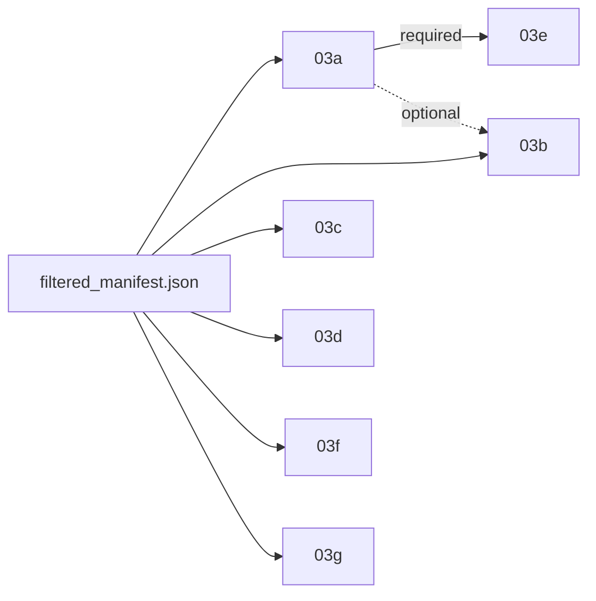

# AI Task Breakdown: Social Feature Layers Architecture

## Objective
This document outlines the core operational paradigm of the project. We extract affective and social context out of the POV video datasets. We utilize a highly extensible "Layer Architecture" where social features are investigated by independent python scripts, each appending its generated metadata safely to the project state.

---

## 🏗️ The "Ongoing Layers" Paradigm
As the repository is updated, we will continuously brainstorm and add independent layers. Each Layer should be developed with these restrictions in mind:
1. **Never modify the original video chunks.**
2. **Never overwrite another Layer's dataset ledger columns/JSON keys.** 
3. **Execute against the `filtered_manifest.json` provided by Node 02.**

### Conceptual Example 1: The `Flinch` Layer
- **Goal**: Measure physical startle responses and abrupt kinesthetic shifts from the POV wearer toward another human.
- **Implementation**: Runs PyTorch/Pose-Tracking on the video. If the velocity of body/arm movement jumps dramatically in correlation to another actor, it sets `flinch_detected: true` and logs the timestamp.

### Conceptual Example 2: The `Engagement/Eye-Contact` Layer
- **Goal**: Evaluate if the other human in the FOV is visibly focused on the camera wearer or acting distracted.
- **Implementation**: Runs facial/gaze tracking. Estimates the pitch/yaw of the other person's face towards the camera's centroid. Logs `attention_score: 0.85`.

---

## 📚 Active Layers Registry
As layers are implemented, they should be tracked here. Each layer follows the naming convention `03x_<layer_name>` where `x` is a lowercase letter assigned in order of creation.

| Layer ID | Name | Document | Output File | Status |
|---|---|---|---|---|
| 03a | Attention / Engagement | `03a_attention_layer.md` | `03a_attention_result.json` | Implemented |
| 03b | Reasonable Emotion | `03b_reasonable_emotion_layer.md` | `03b_reasonable_emotion_result.json` | Planned |
| 03c | Acoustic Prosody | `03c_acoustic_prosody_layer.md` | `03c_acoustic_prosody_result.json` | Implemented |
| 03d | Proxemic Kinematics | `03d_proxemic_kinematics_layer.md` | `03d_proxemic_kinematics_result.json` | Planned |
| 03e | Affirmation Gesture | `03e_affirmation_gesture_layer.md` | `03e_affirmation_gesture_result.json` | Planned |
| 03f | Motor Resonance | `03f_motor_resonance_layer.md` | `03f_motor_resonance_result.json` | Planned |
| 03g | Shared Reality | `03g_shared_reality_layer.md` | `03g_shared_reality_result.json` | Planned |

---

## 🔗 Cross-Layer Data Consumption
Layers are designed to be independent, but some layers *may* consume the output of a sibling layer to enrich their own analysis (e.g., 03b could use the attention score from 03a to weight its emotion analysis—if the bystander isn't even looking, their facial expression may be irrelevant).

**Rules for cross-layer consumption:**
1. A layer **must never assume** another layer has run. Cross-layer data is always optional.
2. If a consumed layer's output is missing for a given `video_id`, the consuming layer must gracefully degrade (use a default value or skip the enrichment).
3. Cross-layer dependencies must be documented in the consuming layer's Input Requirements section.

> ⚠️ **Exception**: Layer 03e (Affirmation Gesture) has a **hard dependency** on 03a's `attention_trace` (specifically the `pitch_rad` and `yaw_rad` fields). It cannot function without this data. Layer 03a must always be run before 03e.

### Dependency Graph

---

## Output Integration
Each layer is designed to output its own `.json` chunk, or it writes into a centralized SQLite/Pandas `result_file` database instance using the `video_id` as the primary key. This is done to ensure the system is completely horizontal—adding a new "Empathy Layer" does not require rewriting the Flinch layer.

---

## 🛡️ Failure & Resumability Policy
All layers **must** adhere to these conventions when processing batches:
1. **Skip on failure**: If a layer fails on a single `video_id`, it must log the error and skip to the next video. The failed ID and traceback should be recorded in a `<layer>_errors.json` file.
2. **Resumability**: If a layer is re-run, it should detect already-completed `video_id` entries and skip them by default. A `--force` flag can override this to reprocess everything.
3. **Atomic writes**: A layer must never produce a partial result for a `video_id`. Either the full output record is written, or nothing is written (write to a temp file first, then rename).
