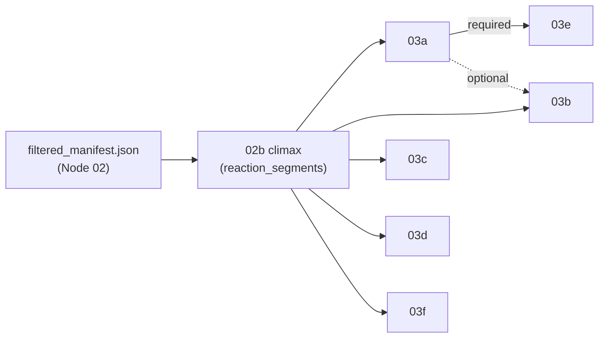

# AI Task Breakdown: Social Feature Layers Architecture

## Objective
This document outlines the core operational paradigm of the project. We extract affective and social context out of the POV video datasets. We utilize a highly extensible "Layer Architecture" where social features are investigated by independent python scripts, each appending its generated metadata safely to the project state.

---

## 🏗️ The "Ongoing Layers" Paradigm
As the repository is updated, we will continuously brainstorm and add independent layers. Each Layer should be developed with these restrictions in mind:
1. **Never modify the original video chunks.**
2. **Never overwrite another Layer's dataset ledger columns/JSON keys.** 
3. **Execute against the `filtered_manifest.json` provided by Node 02.**

### Conceptual Example 1: The `Flinch` Layer
- **Goal**: Measure physical startle responses and abrupt kinesthetic shifts from the POV wearer toward another human.
- **Implementation**: Runs PyTorch/Pose-Tracking on the video. If the velocity of body/arm movement jumps dramatically in correlation to another actor, it sets `flinch_detected: true` and logs the timestamp.

### Conceptual Example 2: The `Engagement/Eye-Contact` Layer
- **Goal**: Evaluate if the other human in the FOV is visibly focused on the camera wearer or acting distracted.
- **Implementation**: Runs facial/gaze tracking. Estimates the pitch/yaw of the other person's face towards the camera's centroid. Logs `attention_score: 0.85`.

---

## 📚 Active Layers Registry
As layers are implemented, they should be tracked here. Each layer follows the naming convention `03x_<layer_name>` where `x` is a lowercase letter assigned in order of creation.

> **Pre-layer stage — Layer 02b (Task Climax / Reaction Segments).** Before any 03x layer runs, `python -m layer_02b_task_climax.pipeline <filtered_manifest.json>` annotates every task with its bystander-anchored `reaction_segments` (docs/02b_task_climax_layer.md, June 30). It annotates the manifest in place rather than emitting a result file, which is why it is 02b and not a 03x layer: it *defines the windows* the 03x layers measure, so it cannot be a sibling. Un-annotated manifests still work via the lazy back-compat wrapper in `shared.climax_extraction`.

| Layer ID | Name | Document | Output File | Status |
|---|---|---|---|---|
| 02b | Task Climax / Reaction Segments | `02b_task_climax_layer.md` | *(annotates `filtered_manifest.json` in place)* | Implemented |
| 03a | Attention / Engagement | `03a_attention_layer.md` | `03a_attention_result.json` | Implemented |
| 03b | Reasonable Emotion | `03b_reasonable_emotion_layer.md` | `03b_reasonable_emotion_result.json` | Implemented |
| 03c | Acoustic Prosody | `03c_acoustic_prosody_layer.md` | `03c_acoustic_prosody_result.json` | Implemented |
| 03d | Proxemic Kinematics | `03d_proxemic_kinematics_layer.md` | `03d_proxemic_kinematics_result.json` | Implemented |
| 03e | Affirmation Gesture | `03e_affirmation_gesture_layer.md` | `03e_affirmation_gesture_result.json` | Implemented |
| 03f | Motor Resonance | `03f_motor_resonance_layer.md` | `03f_motor_resonance_result.json` | Implemented |

---

## 🔗 Cross-Layer Data Consumption
Layers are designed to be independent, but some layers *may* consume the output of a sibling layer to enrich their own analysis (e.g., 03b could use the attention score from 03a to weight its emotion analysis—if the bystander isn't even looking, their facial expression may be irrelevant).

**Rules for cross-layer consumption:**
1. A layer **must never assume** another layer has run. Cross-layer data is always optional.
2. If a consumed layer's output is missing for a given `video_id`, the consuming layer must gracefully degrade (use a default value or skip the enrichment).
3. Cross-layer dependencies must be documented in the consuming layer's Input Requirements section.

> ⚠️ **Exception**: Layer 03e (Affirmation Gesture) has a **hard dependency** on 03a's `attention_trace` (specifically the `pitch_rad` and `yaw_rad` fields). It cannot function without this data. Layer 03a must always be run before 03e.

### Dependency Graph

```mermaid
graph LR
    M["filtered_manifest.json<br/>(Node 02)"] --> L02b["02b climax<br/>(reaction_segments)"]
    L02b --> 03a
    L02b --> 03b
    L02b --> 03c
    L02b --> 03d
    L02b --> 03f
    03a -->|required| 03e
    03a -.->|optional| 03b
```

### Shared Helper: Bystander Measurement-Window Anchoring
Several layers hit the **same geometry problem**: the task's `task_reaction_window_sec` was anchored to the **wearer's** optical-flow climax (±~1 s), but Node-02 bystander detections arrive at a **~6 s cadence** and sit a **median ~7–10 s from that climax** — so the strict window usually held **0–1 bystander detections**, starving any metric that needs the bystander sampled there. *(June 30 update: the Layer 02b bbox-kernel detector snaps the climax to a bystander detection by construction and straddles the window around it, so new manifests hit the direct-window path far more often — 03e direct-window share 10→13 of ~33 in the A/B eval. The helper remains required: a sparse track's detections can still miss the window, and re-anchoring is what makes multi-segment dedup meaningful.)* Each affected layer independently re-discovered and fixed this (03b Resolved #2, 03d Resolved #1/#3, 03e Resolved #1, 03f Resolved #8), so the canonical implementation now lives **once** in **`src/shared/bystander_window.py::bystander_measurement_window`**.

**The rule it encodes:** keep the strict reaction window when it already holds enough samples; otherwise re-anchor to the bystander detection nearest the climax (widened `± anchor_span_detections` indices, padded `± pad_sec`), bounded by `max_anchor_span_sec` (a measurement spanning minutes is locomotion/drift, not a task reaction). Returns `(start, end, source)` — `source ∈ {"reaction_window", "bystander_anchored"}` — or `(None, None, reason)` on skip.

**It is parameterized because the layers genuinely differ** (one knob set per consumer, not one-size-fits-all):

| layer | "dense window" counts | min | pad | single detection? | no-detection reason |
|---|---|---|---|---|---|
| **03d** (proxemic delta) | bystander detections | 2 | 0 s | no — a delta needs 2 endpoints | `single_detection` |
| **03e** (gesture signal) | upstream 03a trace samples | 5 | ±2 s | yes — padded span suffices | `insufficient_trace` |
| **03f** (motor resonance) | bystander detections | 1 | 0 s | yes — dense pose is interpolated across the span | `no_pose_data` |

03d's `_bystander_measurement_window` and 03e's `_measurement_window` are thin wrappers over this helper, and 03f calls it directly (their behavior is pinned by `tests/test_bystander_window.py` plus each layer's own suite). 03b uses a related but distinct *forward-fixed-width* presence anchor that predates the helper and is intentionally left as-is.

### Multi-Window Reaction Segments & the Per-Segment Reward Signal
Climax extraction emits **multiple reaction segments per task** — one per bystander-detection cluster — rather than a single window (docs/02 §3, Resolved #22). This is deliberate, and it shapes the reward signal: the affective signal we want is the bystander's reaction *to each action moment*, so on a long, multi-action task a **per-segment trajectory** ("skeptical at the first attempt → approving after the recovery") is far more informative than one number averaged over the whole task. Each Layer 03 pipeline turns its per-task loop into a per-segment loop with `for task in expand_task_segments(tasks):` (`shared.climax_extraction`), emitting one result row per `(task, segment, bystander)` that carries `segment_index` + the segment's `reaction_window_sec`. A single per-task scalar can always be aggregated *down* from the trajectory (e.g. 03b's late-stage-weighted score); the trajectory cannot be recovered from a scalar — so the layers keep the per-segment detail and Layer 04 can reduce it as needed.

**Two guardrails are mandatory** for that per-segment signal to be *real* rather than duplicated noise — every multi-window consumer (03b/03c/03d/03e/03f) must apply both, in its segment loop:
1. **Distinct-window dedup.** Each layer re-anchors a segment to the bystander's nearest detection (Shared Helper above), so for a sparse bystander *every* segment can collapse onto the **same** measurement window; scoring it per-segment then reports the identical reaction N times. (03e first produced **34,781 "nods" that were only ~1,701 distinct `(clip, person)` reactions** counted a median 13× — up to 70× — each: one 4 s window photocopied.) Score each **distinct `(person, measurement_window)` once** per task and drop a segment that re-derives an already-scored window.
2. **Genuine-track filter.** Skip **untracked** bystanders — Node-02 assigns an untracked box a unique **negative** person id (03d Resolved #4); these phantoms have no real track and, multiplied across segments, dominate the raw counts (the photocopied `person -124`). A positive-id track is genuine and is kept even when brief (a single detection — preserving each layer's single-detection anchoring), since the distinct-window dedup already prevents it from being counted more than once. *(An earlier "≥ 2 detections" form was rejected: it contradicted the deliberate single-detection anchoring and dropped genuine brief bystanders, while the negative-id filter targets the actual phantom source.)*

Together these took 03e from 34,781 raw "nods" to 1,023 (one per genuine `(clip, person)` reaction) — see 03e Resolved #6. *(A naïve frequency gate does **not** work as a third guardrail: at this corpus's low/variable sampling a genuine 1 Hz nod is detected at ~0.7 Hz, overlapping slow drift, so a 1–3 Hz threshold rejects real nods too. Trustworthiness instead comes from using **head pose only**: gaze-derived gestures were proven noise — 0.25 % precision, fabricating a "nod" on 57 % of non-nod windows because the vestibulo-ocular reflex decouples gaze from head-nod — so gaze is discarded, taking the 1,023 down to **30 trustworthy head-pose gestures**; a 6DoF recovery of the missing head pose was tested and deferred. See docs/03e Resolved #11.)*

---

## Output Integration
Each layer is designed to output its own `.json` chunk, or it writes into a centralized SQLite/Pandas `result_file` database instance using the `video_id` as the primary key. This is done to ensure the system is completely horizontal—adding a new "Empathy Layer" does not require rewriting the Flinch layer.

---

## 🛡️ Failure & Resumability Policy
All layers **must** adhere to these conventions when processing batches:
1. **Skip on failure**: If a layer fails on a single `video_id`, it must log the error and skip to the next video. The failed ID and traceback should be recorded in a `<layer>_errors.json` file.
2. **Resumability**: If a layer is re-run, it should detect already-completed `video_id` entries and skip them by default. A `--force` flag can override this to reprocess everything.
3. **Atomic writes**: A layer must never produce a partial result for a `video_id`. Either the full output record is written, or nothing is written (write to a temp file first, then rename).

## 🏃 Running Long Layer Batches (Supervised Runner)
Long Layer-03 batches occasionally hit a silent macOS native crash (the *"Python quit unexpectedly"* mode — an MPS/OpenCV/ffmpeg fault on a particular clip) that leaves no traceback and no exit marker, so a dead run is indistinguishable from a slow one. Every layer pipeline is already resumable (Failure & Resumability Policy above), so the fix is supervision, not pipeline changes.

**Always launch multi-hour layer runs under `tools/run_supervised.sh`:**
```bash
tools/run_supervised.sh <result_json> <runner command...>
# e.g.
tools/run_supervised.sh e2e_reports/<run>/03d_result_50.json ./venv/bin/python tools/run_03d_50.py
```
It wraps each attempt in `caffeinate -dimsu` (blocks system/disk sleep), exports `PYTHONFAULTHANDLER=1` (a native fault dumps a Python traceback into the log instead of vanishing), and relaunches the resumable runner until it exits 0. A **no-progress guard** counts records in `<result_json>` between attempts and aborts after **2 consecutive relaunches that add zero records** — this both breaks a deterministic *poison-clip* crash-loop (layer pipelines mark a `video_id` processed only *after* success, unlike the acquisition orchestrator which marks *before* scoring) and surfaces it loudly. `caffeinate` is auto-skipped on non-macOS hosts; `SR_SUPERVISE_MAX_ATTEMPTS` / `SR_SUPERVISE_LOG` tune the ceiling and log path.

### Parallel Execution — how to run the heavy layers (03d, 03f)

**When to use this.** The depth/SAM (03d) and YOLO-pose (03f) layers alternate, single-threaded, between slow random-seek video decode (CPU) and MPS inference, leaving the M4 Max **~90 % idle** (~1.3 / 16 cores, single-digit RAM %). `tools/run_parallel_layer.py` shards the clips across **N isolated subprocess workers** that share the single MPS GPU — each worker's decode overlaps the others' inference, filling the GPU's idle gaps. Gains saturate around **N = 3–4** (one physical GPU); measured **~3×** at N=3 on the full top-200 (03f: ~7.4 h → ~2.5 h). The lighter layers (03b LLM, 03c audio, 03e trace-only) do **not** need this — run them with the supervised runner above.

**Prerequisite — the per-clip bystander cap (in the pipeline, not the harness).** Node-02 fragments tracking into many short spurious positive-id tracks (median 48, up to **829/clip**); 03d/03f already cap to the `MAX_BYSTANDERS_PER_CLIP = 10` longest tracks (03d Resolved #6, 03f Resolved #11). Without it, one clip's per-bystander Depth/pose alone is a multi-day job and the parallel runner cannot save you.

**1 — Stress-test the heaviest clips first, on a CLEAN GPU.** Never launch the full run blind, and never stress-test while another MPS run is active (the GPU contention is itself the crash risk). `--max-clips 6` selects the 6 heaviest clips (most bystanders):
```bash
python tools/run_parallel_layer.py --layer 03d \
    --manifest "$RUN/03a/input_top200.json" \
    --output   "$RUN/03a/_stress/03d_stress.json" \
    --max-clips 6 --workers 3 --force
```
During the peak (all N workers loaded) watch `memory_pressure | grep "free percentage"`. Pass only if every shard exits 0 and free RAM stays comfortable — validated: **N=3 held 80 % free on Depth-Large + SAM-Huge, 89 % on YOLO-pose, no crash**. If RAM tightens or a worker dies, lower `--workers`.

**2 — Run the full layer.** Same command without `--max-clips`, pointed at the real output:
```bash
python tools/run_parallel_layer.py --layer 03f \
    --manifest "$RUN/03a/input_top200.json" \
    --output   "$RUN/03a/03f_motor_resonance_result.json" \
    --workers 3
```
The orchestrator weight-balances clips into N shards, **staggers** worker startup (`--stagger-sec`, default 30) so N × ~4 GB model loads don't spike at once, **holds** the next launch while free RAM is below `--min-free-ram` (default 20 %), then **merges** the per-shard outputs into the final result on completion.

**3 — Monitor.** The merged output appears only at the end, so track per-shard progress in `<output>.parallel/shard{i}.result.json` (+ `shard{i}.log`); confirm all worker PIDs stay alive, `memory_pressure` holds, and there are zero tracebacks.

**4 — Resume if interrupted.** Everything is resumable: re-run the *same* orchestrator command (sharding is deterministic; each worker skips clips already in its shard output). If a reaped parent orphaned the workers, `pkill -f _shard_worker.py` first, then re-run.

**Knobs:** `--workers` (3), `--stagger-sec` (30), `--min-free-ram` (20), `--max-clips` / `--only-clips <ids>` (stress-test subset), `--force` (ignore existing output). Full detail in the `run_parallel_layer.py` / `_shard_worker.py` docstrings. **Safety rationale** (Apple MPS multi-process is unusual): subprocess isolation gives each worker its own MPS context (crash-isolated, no fork-after-MPS-init hazard); the stagger + RAM floor prevent a model-load memory spike; sharding+merge keeps it resumable.

---

## 🧪 Resolved Issues & Implementation Refinements

1. **Long Unattended Layer Runs Died Silently and Looked "Stuck" (Resolved - June 12)**:
   - **Problem**: Second documented occurrence (June 9–10): the 03d 50-clip post-fix run, launched bare via `tools/run_03d_50.py`, hard-died at 25/50 with no traceback, no exit marker, and no crash report — discovered only ~13 h later. The first occurrence was the late-May reservoir run. `docs/01_dataset_acquisition.md` already mandated an auto-restart wrapper, **but only for the acquisition orchestrator**; Layer-03 runners had none, despite every pipeline being resumable — so recovery was always one relaunch away, yet nothing performed it. A layer-specific edge made naive relaunch unsafe: layer pipelines mark a `video_id` processed only *after* success (the reservoir marks *before* scoring), so a deterministic poison clip could crash-loop forever.
   - **Solution** (Option A): Added `tools/run_supervised.sh <result_json> <runner…>` (documented in "Running Long Layer Batches" above): `caffeinate -dimsu` + `PYTHONFAULTHANDLER=1` + a relaunch-until-exit-0 loop, with a no-progress guard that aborts after 2 consecutive zero-record relaunches (breaks + surfaces poison-clip loops). No pipeline-code change — it composes over the existing resume-by-default behavior. Smoke-tested both paths: a runner crashing twice (with progress) then succeeding reaches a clean DONE; a poison runner that never progresses aborts on the 2-stale guard. `launchd` KeepAlive (Option B) and a heartbeat watchdog (Option C) were declined for now — B's per-run plist ceremony is heavy for ad-hoc runs and C's live-hang detection is a separate need; both can layer on later (a heartbeat watchdog remains the natural follow-up if *hangs*, not just crashes, become a problem).

## ⚠️ Unresolved Issues & Suggestions

_None at this time._
