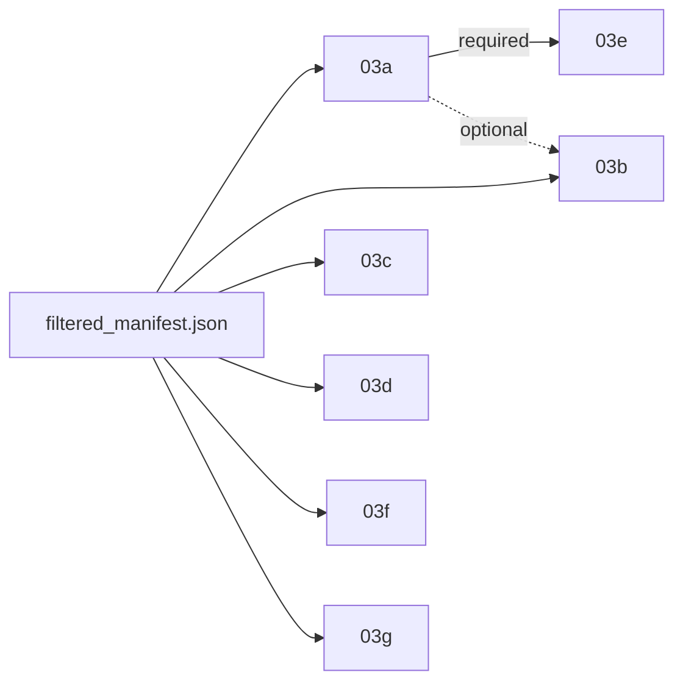

# AI Task Breakdown: Social Feature Layers Architecture

## Objective
This document outlines the core operational paradigm of the project. We extract affective and social context out of the POV video datasets. We utilize a highly extensible "Layer Architecture" where social features are investigated by independent python scripts, each appending its generated metadata safely to the project state.

---

## 🏗️ The "Ongoing Layers" Paradigm
As the repository is updated, we will continuously brainstorm and add independent layers. Each Layer should be developed with these restrictions in mind:
1. **Never modify the original video chunks.**
2. **Never overwrite another Layer's dataset ledger columns/JSON keys.** 
3. **Execute against the `filtered_manifest.json` provided by Node 02.**

### Conceptual Example 1: The `Flinch` Layer
- **Goal**: Measure physical startle responses and abrupt kinesthetic shifts from the POV wearer toward another human.
- **Implementation**: Runs PyTorch/Pose-Tracking on the video. If the velocity of body/arm movement jumps dramatically in correlation to another actor, it sets `flinch_detected: true` and logs the timestamp.

### Conceptual Example 2: The `Engagement/Eye-Contact` Layer
- **Goal**: Evaluate if the other human in the FOV is visibly focused on the camera wearer or acting distracted.
- **Implementation**: Runs facial/gaze tracking. Estimates the pitch/yaw of the other person's face towards the camera's centroid. Logs `attention_score: 0.85`.

---

## 📚 Active Layers Registry
As layers are implemented, they should be tracked here. Each layer follows the naming convention `03x_<layer_name>` where `x` is a lowercase letter assigned in order of creation.

| Layer ID | Name | Document | Output File | Status |
|---|---|---|---|---|
| 03a | Attention / Engagement | `03a_attention_layer.md` | `03a_attention_result.json` | Implemented |
| 03b | Reasonable Emotion | `03b_reasonable_emotion_layer.md` | `03b_reasonable_emotion_result.json` | Implemented |
| 03c | Acoustic Prosody | `03c_acoustic_prosody_layer.md` | `03c_acoustic_prosody_result.json` | Implemented |
| 03d | Proxemic Kinematics | `03d_proxemic_kinematics_layer.md` | `03d_proxemic_kinematics_result.json` | Implemented |
| 03e | Affirmation Gesture | `03e_affirmation_gesture_layer.md` | `03e_affirmation_gesture_result.json` | Implemented |
| 03f | Motor Resonance | `03f_motor_resonance_layer.md` | `03f_motor_resonance_result.json` | Implemented |
| 03g | Shared Reality | `03g_shared_reality_layer.md` | `03g_shared_reality_result.json` | Implemented |

---

## 🔗 Cross-Layer Data Consumption
Layers are designed to be independent, but some layers *may* consume the output of a sibling layer to enrich their own analysis (e.g., 03b could use the attention score from 03a to weight its emotion analysis—if the bystander isn't even looking, their facial expression may be irrelevant).

**Rules for cross-layer consumption:**
1. A layer **must never assume** another layer has run. Cross-layer data is always optional.
2. If a consumed layer's output is missing for a given `video_id`, the consuming layer must gracefully degrade (use a default value or skip the enrichment).
3. Cross-layer dependencies must be documented in the consuming layer's Input Requirements section.

> ⚠️ **Exception**: Layer 03e (Affirmation Gesture) has a **hard dependency** on 03a's `attention_trace` (specifically the `pitch_rad` and `yaw_rad` fields). It cannot function without this data. Layer 03a must always be run before 03e.

### Dependency Graph

```mermaid
graph LR
    M["filtered_manifest.json"] --> 03a
    M --> 03b
    M --> 03c
    M --> 03d
    M --> 03f
    M --> 03g
    03a -->|required| 03e
    03a -.->|optional| 03b
```

---

## Output Integration
Each layer is designed to output its own `.json` chunk, or it writes into a centralized SQLite/Pandas `result_file` database instance using the `video_id` as the primary key. This is done to ensure the system is completely horizontal—adding a new "Empathy Layer" does not require rewriting the Flinch layer.

---

## 🛡️ Failure & Resumability Policy
All layers **must** adhere to these conventions when processing batches:
1. **Skip on failure**: If a layer fails on a single `video_id`, it must log the error and skip to the next video. The failed ID and traceback should be recorded in a `<layer>_errors.json` file.
2. **Resumability**: If a layer is re-run, it should detect already-completed `video_id` entries and skip them by default. A `--force` flag can override this to reprocess everything.
3. **Atomic writes**: A layer must never produce a partial result for a `video_id`. Either the full output record is written, or nothing is written (write to a temp file first, then rename).

## ⚠️ Unresolved Issues & Suggestions

### Issue 1: Long unattended layer runs die silently and look "stuck" — no supervision, relaunch, or alerting
**Status**: ⚠️ Confirmed Unresolved — **Second documented occurrence, June 9–10**: the 03d 50-clip post-fix run (depth + SAM on MPS, launched bare via `tools/run_03d_50.py`) hard-died at **25/50 around 21:51** — the log stops mid-clip with **no traceback**, the wrapper shell never wrote its exit marker (0-byte task output, so the session's background-task indicator kept looking like a live run), and **no crash report** landed in `~/Library/Logs/DiagnosticReports/`. The death was discovered only ~13 hours later when a human asked why it looked stuck; a manual `force=False` relaunch then completed the remaining 25 clips with zero data loss. The first occurrence was the late-May reservoir run (the macOS *"Python quit unexpectedly"* native-crash mode), which is why `docs/01_dataset_acquisition.md` (lines ~49–53) mandates an **auto-restart wrapper — but only for the acquisition orchestrator**. Layer-03 batch runners (`tools/run_03*_50.py` and the upcoming full-corpus runs) have no such supervision: every pipeline already satisfies this doc's Resumability Policy (per-video atomic writes + resume-by-default), so recovery is always one relaunch away, yet **nothing performs that relaunch, nothing detects the death, and a dead run is indistinguishable from a slow one** to an unattended operator. One sharp edge distinguishes layers from acquisition: the reservoir marks each UID processed *before* scoring (a crashing clip is skipped on relaunch), whereas layer pipelines mark a `video_id` processed only *after* success — so naive auto-relaunch can **crash-loop on a deterministic poison clip**; any supervisor must handle that.

**Option A (recommended)**: **Shared supervised-runner wrapper** (`tools/run_supervised.sh <runner.py>`), generalizing the proven docs/01 acquisition pattern to every layer runner: `caffeinate -dimsu` (blocks system/disk sleep for the run's lifetime) + `PYTHONFAULTHANDLER=1` (native faults dump a Python traceback into the log instead of dying silently) + a relaunch loop that re-invokes the resumable runner until it prints its DONE marker, with a **no-progress guard** (count result-file records between attempts; abort after 2 consecutive relaunches with zero new records, which both breaks poison-clip crash-loops and surfaces them loudly) and a timestamped supervisor log line per attempt.
  - *Pros*: One ~30-line script covers every current and future layer runner with no pipeline-code changes (all already resume); converts the observed failure mode from "stuck overnight, found dead 13 h later" into "self-healed within seconds, attempts logged"; `PYTHONFAULTHANDLER` finally captures which clip/op kills the process; the progress guard prevents the poison-clip loops the acquisition wrapper never had to worry about.
  - *Cons*: `caffeinate` keeps the Mac Studio awake for the whole run (deliberate energy cost); a poison clip still costs 2 relaunch cycles before aborting (mitigable later by adding mark-in-flight skip semantics to the pipelines, a larger change).

**Option B**: **`launchd` KeepAlive agent per long run** — register the runner as a user LaunchAgent with `KeepAlive.SuccessfulExit=false` plus a `caffeinate` assertion, letting macOS itself own the relaunch.
  - *Pros*: OS-native supervision that survives logout and (with RunAtLoad) reboot — the strongest guarantee for multi-day full-corpus jobs.
  - *Cons*: Per-run plist install/uninstall ceremony is heavy for ad-hoc smell tests; no built-in progress guard (a poison clip loops forever unless wrapped anyway); run state is less visible from the working session.

**Option C**: **Heartbeat watchdog** — each runner touches a heartbeat file after every video; a watchdog (cron/launchd, every 5 min) kills and relaunches any run whose heartbeat is staler than N minutes and appends an alert line to the run log.
  - *Pros*: The only option that also catches **live hangs** (process alive but wedged in an MPS op) rather than just deaths; heartbeat staleness doubles as a cheap progress display.
  - *Cons*: Two moving parts (runner instrumentation + a scheduled watchdog) and a kill threshold that must exceed the slowest legitimate clip (climax on a 300 s video) to avoid killing healthy runs; does not by itself prevent sleep or capture native-crash tracebacks, so it still wants Option A's `caffeinate`/`PYTHONFAULTHANDLER` pieces.

Your selection: Proceed with Option A.
