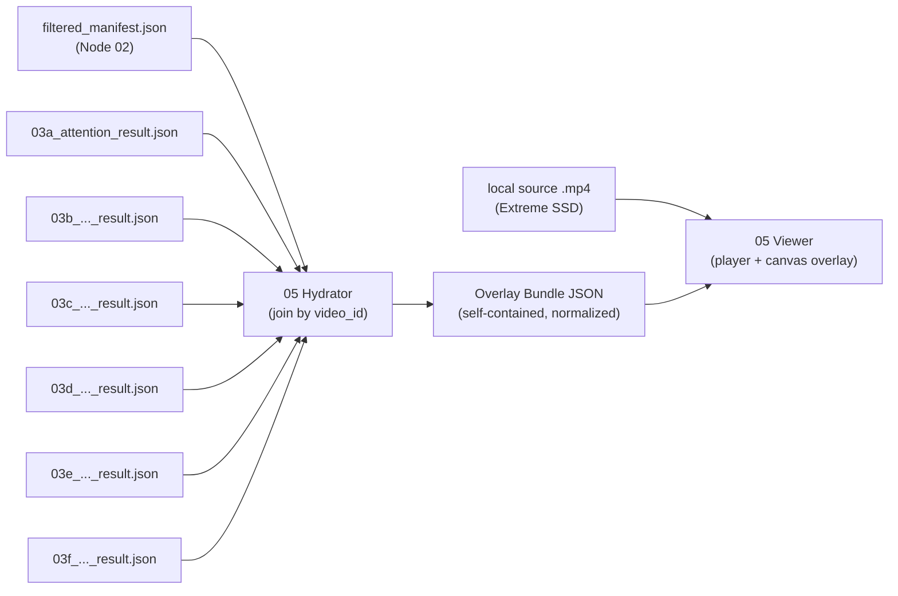

# AI Task Breakdown: Manifest Hydration & Real-Time Signal Visualizer

## Objective
Build a **local, interactive visualization tool** that "hydrates" a clip — joining the
`filtered_manifest.json` produced by Node 02 with every `03*_result.json` layer output —
and **plays the source video with all extracted social signals overlaid in real time**,
synced frame-accurately to playback. The tool is a video player: it supports play / pause /
scrub / step, per-layer toggles, and a multi-lane signal timeline.

This is a **QA, debugging, and demo instrument**, not a pipeline-output stage. Its job is to
let a human *see* what the layers saw — bounding boxes, gaze vectors, emotion transitions,
proxemic approach, nods, flinches — overlaid on the actual pixels, so that **silent
degradation** (the failure class this project fights everywhere: an all-`None` export column,
a "nod" that is a photocopied window, a box that drifted onto the wearer's own chin) becomes
visible instead of hidden in a JSON array.

> **05 is the inverse of 04.** Node 04 *de*hydrates (strips pixels, exports `.parquet` for the
> world). Node 05 *re*hydrates **locally** for the operator — it reads the **local** source
> videos on the Extreme SSD and never exports a single pixel off-host. The annotated video, if
> rendered, stays local. 05 is **explicitly excluded** from the Hugging Face export surface.

---

## 🧭 Where 05 Sits in the Pipeline



The tool has **two cleanly separated parts**:

1. **The Hydrator** (`hydrate.py`) — a pure data-join step. No video decoding, no rendering. It
   merges the manifest and all layer results for a `video_id` into a single **Overlay Bundle
   JSON**: a self-contained, display-resolution-independent, time-normalized description of
   everything to draw. This is the analog of `rehydrate_dataset.py` (Node 04) but aimed at a
   renderer rather than a researcher's `pandas` frame.
2. **The Viewer** (`server.py` + `static/`) — a real-time player that streams the local video
   and draws the Overlay Bundle on a `<canvas>` synced to `video.currentTime`.

Keeping these split means the Hydrator is unit-testable headless (no GPU, no display, no
codec), and the Viewer is a thin, dumb renderer driven entirely by the bundle.

---

## 📥 Part 1 — The Hydration Step (Data Join)

### 1.1 Inputs

| Input | Source | Notes |
|---|---|---|
| **Manifest** | `filtered_manifest.json` **or** the per-run `manifest_sub.json` actually consumed by the layer run | The manifest carries the `bystander_detections`, `identified_tasks`, `fps`, `duration_sec`, and the **local** `video_path`. |
| **Layer results** | `03a..03f` `*_result.json` files (one record per `video_id`) | Each is an outer list keyed by `video_id`. Missing layers degrade gracefully (the bundle just omits that overlay). |
| **Source video** | local file at `manifest.video_path` (e.g. `/Volumes/Extreme SSD/social_robotics/raw_videos/ego4d/...`) | Referenced by the Viewer, **not** read by the Hydrator. |
| *(optional)* layer-04 parquet | `social_metadata.parquet` | Only the per-layer `*_raw` JSON-string columns are usable for overlays; the scalar summary columns lose the per-frame trace. Prefer the raw `03*_result.json`. See Unresolved Issue 3. |

### 1.2 The Join Key and the `video_id` Trap

The join key is `video_id`. **Critical gotcha, already a live source of confusion in this
repo:** the toy `filtered_manifest.json` at the repo root uses Charades-style short IDs
(`OHLJPEGO`), while the real E2E runs used **Ego4D UUIDs** (`0c163d16-8c47-...`). A layer
result keyed by a UUID will silently fail to join against the short-ID manifest, producing an
empty overlay that *looks* like "the layer found nothing."

**Rule:** the Hydrator must be pointed at the **same manifest the layer run consumed** — i.e.
the `manifest_sub.json` (or equivalent input) inside the run directory, **not** the repo-root
manifest. The Hydrator must **fail loudly** when a requested `video_id` is absent from the
manifest, and must **warn** (not silently drop) when a layer result references a `video_id`
the manifest does not contain, or vice-versa. (See Unresolved Issue 3 for making this
provenance binding first-class.)

### 1.3 Coordinate Normalization (the alignment-critical part)

Bystander and hand boxes in the manifest are stored as **integer pixel coordinates in the
*original*, full-resolution video frame**, in `[x1, y1, x2, y2]` (top-left, bottom-right)
order. This is verifiable in `src/shared/social_presence.py`: detection runs
`self.model.track(batch_frames, ...)` on the **raw** decoded frames (the only `cv2.resize` in
that file is a 768-px downscale used *solely* for the VLM yes/no check, not for detection), and
boxes are taken as `coords = [int(v) for v in box.xyxy[0].tolist()]` against
`img_h, img_w = batch_frames[i].shape[:2]`.

Consequence: **the box coordinate space is the native video resolution.** A `<video>` element
in a browser is almost never displayed at native resolution, so the overlay must scale. To keep
the Viewer dumb and resolution-independent, the **Hydrator normalizes every spatial coordinate
to `[0.0, 1.0]`** relative to native width/height:

```
nx = x_px / native_width        ny = y_px / native_height
```

The bundle records `native_width`/`native_height` (read once via
`cv2.VideoCapture(...).get(CAP_PROP_FRAME_WIDTH/HEIGHT)` — this is the **one** place the
Hydrator touches the video, and it reads only the header, never decodes frames). The Viewer
then multiplies normalized coords by the **rendered** canvas size, so overlays stay aligned at
any window size, on any display, after any CSS scaling. **Never** ship pixel coordinates to the
frontend — they will be wrong the moment the window is resized.

> **Aspect-ratio caveat:** the canvas must be sized to the video's *displayed* box using
> `object-fit: contain` math (letterbox/pillarbox aware), not the element's raw client box, or
> normalized coords land in the black bars. The Viewer computes the displayed content rect from
> `videoWidth/videoHeight` vs the element rect each frame.

### 1.4 Temporal Normalization (reconciling cadences)

Every signal lives on a **different temporal grid**, and the Hydrator must tag each with its
native cadence and an explicit interpolation policy so the Viewer never guesses:

| Signal | Native cadence | Interp policy | Why |
|---|---|---|---|
| Bystander boxes | **sparse, ~3–6 s** (Node 02 samples 1 frame / 3 s; per-track gaps are larger) | **hold-last within `gap_tolerance_sec`, else hide** | A box is a discrete observation; linear-interpolating across a 6 s gap invents motion. Hold briefly, then drop to "stale/unknown." |
| `attention_trace` (03a) | **dense, ~8 fps** (`sampling_fps_effective: 8.0`, burst 32) | **nearest-sample** (optionally linear on angles) | Dense enough to feel continuous; nearest is honest, linear on `pitch_rad`/`yaw_rad` is acceptable for a smooth arrow. |
| Emotion slices (03b) | **windowed** (`window_sec` per slice) | **band / step** | Defined over an interval, not an instant. Light up while `t ∈ window`. |
| Prosody (03c) | **windowed** (`task_reaction_window_sec`) + waveform | **band** + continuous VU | Tone/emotion is per-window; the waveform itself is continuous if audio is present. |
| Proxemic (03d) | **windowed** (`measurement_window_sec`) | **band** | A delta over a window has no per-frame value; show the verdict across the window. |
| Gesture (03e) | **windowed** (`measurement_window_sec`) | **band + pulse** | Oscillation Hz is a window property; pulse animation conveys the nod rhythm. |
| Motor resonance (03f) | **windowed** (`reaction_window_sec`) + `ego_kinetic_chaos_score` per task | **band** | Per-task scalar + per-person verdict over the window. |
| Task climax (02) | **instant** (`task_climax_sec`) | **marker** | A single frame-time flag on the timeline. |

The Viewer **must not** linearly interpolate windowed signals into per-frame values — doing so
would fabricate a temporal resolution the layer never claimed.

### 1.5 Identity & Color

`person_id` is the bystander track id. The Hydrator assigns each a **stable color** (hash of
`person_id` into a fixed palette) so the same person is the same color in the box, the gaze
arrow, the emotion label, and the timeline lane.

**Negative `person_id`s are untracked phantoms** — Node 02 assigns an untracked detection a
monotonic **negative** id (see `social_presence.py` `untracked_person_id = -1`), and the Layer
03 "genuine-track filter" deliberately drops these (docs/03 § Multi-Window Reaction Segments,
03d Resolved #4). The Hydrator must **tag** negative-id tracks as `phantom: true` and the Viewer
must render them in a **distinct, de-emphasized style** (dashed, low-opacity) and offer a
**"hide phantoms" toggle on by default** — so the operator sees the same genuine tracks the
layers scored, but can reveal the phantoms to understand a suspicious count.

### 1.6 The Overlay Bundle Schema

One bundle per `video_id` (the Hydrator can also emit a bundle directory for a whole run). The
schema is the contract between Hydrator and Viewer:

```jsonc
{
  "schema_version": "05.1.0",
  "video_id": "0c163d16-8c47-4773-a25f-2ee57ce9ab87",
  "source_dataset": "ego4d",
  "clip": {
    "video_path": "/Volumes/Extreme SSD/.../0c163d16....mp4",  // local; Viewer serves via range requests
    "native_width": 1920,
    "native_height": 1080,
    "fps": 30.0,
    "duration_sec": 94.53,
    "has_audio": true                 // from 03c.audio_present if present, else probed
  },
  "layers_present": ["02_manifest", "03a", "03c", "03d", "03f"],  // honest list; missing = overlay omitted
  "people": {
    "0":  { "color": "#4FC3F7", "phantom": false },
    "-12":{ "color": "#9E9E9E", "phantom": true }
  },

  // ---- TRACKS: per-person spatial + per-person windowed verdicts -------------
  "tracks": [
    {
      "person_id": 0,
      "boxes": [                       // normalized [0..1], sparse, hold-last
        { "t": 6.0,  "box": [0.038, 0.0,   0.150, 0.248], "conf": 0.80 },
        { "t": 12.0, "box": [0.240, 0.167, 0.472, 0.840], "conf": 0.57 }
      ],
      "gap_tolerance_sec": 4.0,        // hide box if now-t exceeds this past last sample

      "attention": {                   // 03a, dense
        "summary": { "average_attention_score": 0.21, "is_engaged": false,
                     "gaze_target_classification": "Camera",
                     "peak_engagement_timestamp_sec": 11.75 },
        "trace": [                     // ~8 fps; nearest-sample lookup
          { "t": 4.00, "score": 0.0, "pitch_rad": 0.0, "yaw_rad": 0.0,
            "head_pitch_rad": null, "head_yaw_rad": null, "target": "NoFace" }
        ]
      },

      "windows": [                     // 03b/03d/03e/03f per-person verdicts, each a timeline band
        { "layer": "03b", "window_sec": [66.0, 66.33], "kind": "emotion_slice",
          "transition_pair": ["sadness", "sadness"], "classified_direction": "neutral",
          "terminal_magnitude": 0.68, "segment_index": 0 },
        { "layer": "03d", "window_sec": [84.0, 108.0], "kind": "proxemic",
          "classified_action": "Approach_Intervention", "proxemic_vector": 0.0,
          "bbox_scale_delta_pct": 134.62, "proxemic_confidence": 0.0,
          "window_source": "bystander_anchored" },
        { "layer": "03e", "window_sec": [-2.0, 5.0], "kind": "gesture",
          "gesture_detected": "affirming_nod", "pitch_oscillation_hz": 0.79,
          "yaw_oscillation_hz": 0.0, "confidence": 1.0, "window_source": "bystander_anchored" },
        { "layer": "03f", "window_sec": [49.57, 51.57], "kind": "motor_resonance",
          "motor_resonance_detected": false, "bystander_pose_velocity_peak": 6.9,
          "mirroring_detected": false, "resonance_delay_sec": 0.0 }
      ]
    }
  ],

  // ---- TASK TIMELINE: climax markers + reaction windows + multi-window segments
  "tasks": [
    { "task_id": "t_01", "task_label": "jobs related to construction/renovation",
      "task_velocity": "medium", "task_confidence": 1.0,
      "climax_sec": 48.57, "climax_method": "optical_flow_peak_only",
      "optical_flow_peak_magnitude": 26.42,
      "reaction_windows_sec": [[49.57, 51.57]],   // one per multi-window segment (docs/02 §3)
      "ego_kinetic_chaos_score": 1.0 }             // 03f, per task (wearer)
  ],

  // ---- CLIP-LEVEL audio (03c, one per task reaction window) ------------------
  "audio": [
    { "task_id": "t_01", "window_sec": [49.57, 51.57], "audio_present": true,
      "classified_acoustic_tone": "Neutral", "dominant_emotion": "neutral",
      "dominant_emotion_confidence": 0.0, "max_amplitude_dbFS": -22.4,
      "pitch_contour_variance": 0.0,
      "audio_events": [] }
  ],

  // ---- optional: hand boxes (manifest hand_detections) -----------------------
  "hands": [ { "t": 0.0, "boxes": [[0.223, 0.369, 0.336, 0.569]] } ]
}
```

Design rules baked into the schema:
- **Self-contained.** No cross-file references at render time; the Viewer needs only the bundle
  + the video. A bundle can be archived next to a run for later replay.
- **Honest about provenance.** `layers_present` and `window_source` are surfaced so the operator
  can *see* when a window was re-anchored to the nearest bystander detection
  (`"bystander_anchored"`) vs the strict reaction window (`"reaction_window"`) — the exact
  distinction the Shared Bystander-Window helper makes (docs/03 § Shared Helper). An overlay that
  hides re-anchoring would mislead.
- **Resolution-independent.** All spatial coords normalized; the Viewer owns display scaling.
- **Degrades cleanly.** Any absent layer/field simply produces no overlay for it.

### 1.7 Hydrator API (proposed)

```python
# src/layer_05_visualizer/hydrate.py
def build_overlay_bundle(
    video_id: str,
    manifest_path: str | Path,
    results_dir: str | Path,           # dir containing 03*_result.json
    *,
    probe_video: bool = True,          # read native W/H/fps/has_audio from the file header
    include_phantoms: bool = True,     # keep negative-id tracks (tagged phantom)
) -> dict: ...

def write_bundles_for_run(
    manifest_path, results_dir, out_dir, *, video_ids: list[str] | None = None
) -> list[Path]: ...   # one <video_id>.bundle.json per clip, plus an index.json
```

The Hydrator is **pure + headless** (except the optional one-shot header probe) and therefore
fully unit-testable: feed it fixture JSON, assert the bundle. See § Verification.

---

## 🎬 Part 2 — The Viewer (Real-Time Player)

### 2.1 Delivery Mechanism (recommended: local web app)

A **local single-user web app** is the recommended Viewer (see Unresolved Issue 1 for the full
trade-off against an offline OpenCV renderer and a Jupyter widget). Rationale:

- A real `<video>` element gives **free, native, frame-accurate** play / pause / scrub / seek /
  variable-rate playback — exactly "a video player of some sort."
- HTML5 `<canvas>` over the video is the cleanest way to draw vector overlays (arrows, rings,
  bands) that stay crisp at any zoom.
- It reuses the existing Python stack for the backend; the frontend is dependency-free vanilla
  JS (no build step), which suits a research tool.
- It runs **purely local** (`127.0.0.1`), so no pixel ever leaves the host — consistent with the
  dehydration ethics rule.

### 2.2 Backend (`server.py`, FastAPI or Flask)

Three responsibilities, nothing more:

1. **`GET /video/{video_id}`** — stream the local file at `bundle.clip.video_path` with **HTTP
   Range** support (`206 Partial Content`). Range support is *mandatory* — without it the browser
   cannot seek/scrub, it can only play from 0. (FastAPI: parse the `Range` header, `seek` the
   file, return the byte slice with `Content-Range`/`Accept-Ranges`.)
2. **`GET /bundle/{video_id}`** — return the Overlay Bundle JSON (built on demand by the Hydrator
   or read from a pre-built bundle dir).
3. **`GET /`** and `/static/*` — serve the player page and assets.

The backend **must restrict** `video_path` resolution to an allow-listed root (the configured
SSD video dir) so the server can't be coaxed into serving arbitrary host files — a local tool,
but still good hygiene.

### 2.3 Frontend Layout

```
┌───────────────────────────────────────────────────────────────────────┐
│  [clip 0c163d16…  ego4d  1920×1080  30fps  94.5s]      layers: present  │
├──────────────┬──────────────────────────────────────┬─────────────────┤
│ LAYER TOGGLES│                                        │  LIVE READOUTS  │
│ ☑ boxes      │        <video> + <canvas overlay>      │  t = 48.6s      │
│ ☑ 03a gaze   │        (overlays drawn here)           │  person 0:      │
│ ☑ 03b emotion│                                        │   attn 0.21     │
│ ☑ 03c prosody│                                        │   target Camera │
│ ☑ 03d proxemic                                        │  ego chaos 1.0  │
│ ☑ 03e gesture│                                        │  tone  Neutral  │
│ ☑ 03f motor  │                                        │                 │
│ ☐ phantoms   │                                        │                 │
│ legend:●0 ●3 │                                        │                 │
├──────────────┴──────────────────────────────────────┴─────────────────┤
│ ▶  ⏸  ◀▏ ▏▶   0.25× 0.5× 1× 2×        [============●===========] 48.6s  │
│ TIMELINE LANES (one per layer, time-aligned to scrubber):              │
│  task    │        ◆climax(48.6)   ▭reaction[49.6–51.6]                 │
│  03a     │  ▁▂▃▅▇▅▃ engagement sparkline (person 0)                    │
│  03b     │              ▭ sad→sad(neutral)                             │
│  03d     │      ▭▭▭▭▭▭▭▭▭▭ Approach_Intervention [84–108]              │
│  03e     │            ▭ nod 0.79Hz                                     │
│  03f     │              ▭ resonance? band                              │
└───────────────────────────────────────────────────────────────────────┘
```

- **Center:** the `<video>` with a pixel-matched, absolutely-positioned `<canvas>` on top.
- **Left:** per-layer visibility toggles + per-person color legend + a "hide phantoms" switch.
- **Right:** live numeric readouts of whatever is active at the playhead.
- **Bottom:** transport controls + a multi-lane **timeline**, one lane per layer, so the operator
  can scrub straight to "where 03e fired a nod" or "the climax." Clicking a lane event seeks.

### 2.4 The Sync Loop (frame-accurate overlay)

The overlay is driven by a `requestAnimationFrame` loop that reads the **single source of truth**,
`video.currentTime`, every tick. **Never** drive overlays off a JS timer — it drifts from the
decoder; always read `currentTime`.

```
function renderFrame():
    t = video.currentTime
    rect = computeDisplayedContentRect(video)   // object-fit: contain aware (letterbox)
    clear(canvas)

    for track in bundle.tracks:
        if track.phantom and not showPhantoms: continue

        # --- box: binary-search timestamps, hold-last within tolerance, else hide ---
        s = lastSampleAtOrBefore(track.boxes, t)
        if s and (t - s.t) <= track.gap_tolerance_sec:
            drawBox(rect, s.box, color=people[track.id].color, stale=(t - s.t > 0.5))
            faceCentroid = topCenterOf(s.box)

            # --- 03a gaze: nearest dense sample, arrow from face by pitch/yaw ---
            if layerOn('03a'):
                g = nearestSample(track.attention.trace, t)
                drawGazeArrow(rect, faceCentroid, g.pitch_rad, g.yaw_rad,
                              score=g.score, target=g.target)
                drawEngagementRing(rect, s.box, track.attention.summary)

            # --- windowed per-person verdicts: draw badge iff t ∈ window ---
            for w in track.windows:
                if layerOn(w.layer) and within(t, w.window_sec):
                    drawWindowBadge(rect, s.box, w)   # emotion arrow / proxemic arrow / nod pulse / flinch flash

    # --- task markers & ego chaos (wearer-level, not tied to a box) ---
    for task in bundle.tasks:
        if near(t, task.climax_sec): flashClimax()
        updateEgoChaosMeter(task.ego_kinetic_chaos_score if withinAnyReaction(t, task) else null)

    # --- audio: VU/waveform + tone badge during reaction window ---
    if layerOn('03c'): updateProsody(t, bundle.audio)

    updateReadouts(t); updateScrubber(t)
    requestAnimationFrame(renderFrame)
```

Helper notes:
- `lastSampleAtOrBefore` / `nearestSample` are **binary searches** over pre-sorted arrays — O(log n)
  per track per frame, trivial even with thousands of trace points.
- `stale` styling (e.g. fade the box) communicates "this is the last known position, N seconds
  old" rather than implying a fresh detection — honesty about the sparse cadence.
- All drawing multiplies normalized coords by `rect` (the displayed content rect), never by the
  raw element size.

### 2.5 Per-Layer Rendering Spec (the heart of the tool)

Each layer has a deliberate visual language. These are the on-frame encodings:

- **02 Manifest — bystander boxes & hands.** Rectangle per person in the person's color, label
  `P{id}` + detection confidence. Phantoms dashed/low-opacity. Hand boxes (if shown) as thin
  secondary rectangles. A small "stale Δt" tag when holding a box past its last sample.

- **03a Attention / Gaze.** From the face centroid (top-center of the box), draw a **3D gaze
  arrow** projecting `pitch_rad`/`yaw_rad` into screen space (reuse the projection logic already
  in `analyze_attention.py`, which renders gaze vectors via L2CS Euler angles). An **engagement
  ring** around the head, filled proportional to `score` and tinted by it (red→green). Label the
  `target` (`Camera` / `NoFace` / `Away`). When `head_pitch_rad`/`head_yaw_rad` are present
  (head-pose mode), offer a second, differently-styled arrow — the head-pose-only signal 03e
  actually trusts (docs/03e Resolved #11). A per-person **engagement sparkline** in the 03a
  timeline lane.

- **03b Reasonable Emotion.** During an emotion slice's `window_sec`, render the
  `transition_pair` above the box as `from → to` (e.g. `sad → happy`), colored by
  `classified_direction` (approving = green, skeptical/negative = red, neutral = gray), with
  `terminal_magnitude` as the label's opacity/weight. Because slices form a **trajectory** across
  a task (docs/03 § Multi-Window Reaction Segments), the 03b lane shows the ordered slices so the
  operator reads the arc ("skeptical → approving"), not a single average.

- **03c Acoustic Prosody.** A **VU meter / waveform strip** along the bottom synced to `t` (driven
  by the actual decoded audio via WebAudio, *or* a precomputed amplitude envelope in the bundle —
  see Unresolved Issue 4). During a task's reaction window, a badge shows
  `classified_acoustic_tone` + `dominant_emotion` (+ confidence). When `audio_present == false`
  (common — many clips are silent; 03c emits `-100 dBFS`, all-zero emotions), show an explicit
  **"no audio"** indicator rather than a misleading flat-zero meter.

- **03d Proxemic Kinematics.** Over `measurement_window_sec`, draw an **approach/avoidance arrow**
  on the box pointing toward (Approach_Intervention) or away from (Avoidance) the camera, sized by
  `bbox_scale_delta_pct` (growing bbox ⇒ approaching). Badge the `classified_action` and
  `proxemic_confidence`. Show `window_source` so a `bystander_anchored` (re-anchored) window is
  visually flagged vs a strict `reaction_window`. The band spans the (often long) measurement
  window in the 03d lane.

- **03e Affirmation Gesture.** During the gesture window, a **nod/shake icon** that **pulses at
  `pitch_oscillation_hz`** (a nod literally bobbing at its detected frequency is the most
  intuitive possible rendering), labeled with the Hz and `confidence`. Render **only head-pose**
  gestures emphatically (the trusted signal) and gaze-derived ones, if ever present, as
  explicitly-untrusted — mirroring docs/03e's discard of gaze gestures. `interpolated_fraction`
  shown as a "data quality" tick so a heavily-interpolated nod is visibly less certain.

- **03f Motor Resonance.** A wearer-level **ego-kinetic-chaos meter** (`ego_kinetic_chaos_score`,
  per task) — the "how violently is the camera/wearer moving right now" gauge. Per person, a
  **flinch/startle flash** when `motor_resonance_detected`, and a **mirroring** glyph when
  `mirroring_detected`; `bystander_pose_velocity_peak` as a spike. If `resonance_delay_sec > 0`,
  draw a connector from the ego-spike instant to the bystander reaction to visualize the
  sympathetic lag.

- **02 Task layer.** `◆ climax` diamond on the timeline at `task_climax_sec`, a shaded
  **reaction-window band** per multi-window segment, label = `task_label` + `task_velocity`. The
  playhead snapping to climax is the single most useful "jump here" affordance for QA.

### 2.6 Real-Time & Performance Constraints

- **External-SSD seek latency.** The source videos live on the Extreme SSD; random seeks on
  multi-minute Ego4D clips over USB can stall scrubbing. For scrub-heavy sessions, the Viewer
  should support an optional **low-res proxy** (a one-time `ffmpeg` transcode to a small,
  keyframe-dense `.mp4` cached locally) used for the `<video>` while overlays still come from the
  full-res-derived bundle. (Overlays are resolution-independent, so a proxy doesn't move them.)
  See Unresolved Issue 4.
- **Draw cost.** rAF runs ~60 Hz; with binary-search lookups and a handful of tracks the per-frame
  cost is microseconds. Pre-sort all timelines in the Hydrator so the frontend never sorts.
- **Decode vs overlay drift.** Always re-read `video.currentTime` each frame; never accumulate a
  JS clock. On `seeked`/`pause`, re-render once immediately so a paused frame shows correct
  overlays.

---

## 🗂️ Part 3 — Module & File Layout

```
src/layer_05_visualizer/
├── __init__.py
├── hydrate.py            # build_overlay_bundle(), write_bundles_for_run()  — pure/headless
├── bundle_schema.py      # schema constants + a validate_bundle() guard (no silent shape drift)
├── server.py             # FastAPI/Flask: /video (range), /bundle, /, /static
├── colors.py             # stable person_id -> color palette hashing
└── static/
    ├── index.html        # player shell (video + canvas + panels)
    ├── app.js            # transport, toggles, timeline, sync loop
    ├── overlay.js        # per-layer draw functions (drawGazeArrow, drawWindowBadge, ...)
    └── styles.css

tools/
└── run_visualizer.py     # CLI launcher: hydrate (if needed) + start server + open browser
```

This mirrors the existing per-node layout (`src/layer_04_dehydrated_export/` has `aggregator.py`,
`per_layer.py`, `rehydrate_dataset.py`, `huggingface_upload.py`). Tests go in
`tests/test_layer_05.py` (Hydrator/bundle logic) — the frontend draw code is validated visually
per § Verification.

---

## 🚀 Part 4 — Running It

```bash
# 1. Build bundles for a finished run (headless; safe to run anywhere)
./venv/bin/python -m src.layer_05_visualizer.hydrate \
    --manifest e2e_reports/2026_06_14_layer03e_headpose/manifest_sub.json \
    --results-dir e2e_reports/2026_06_14_layer03e_headpose \
    --out-dir e2e_reports/2026_06_14_layer03e_headpose/bundles

# 2. Launch the local viewer (serves the SSD video + the bundles)
./venv/bin/python tools/run_visualizer.py \
    --bundles e2e_reports/2026_06_14_layer03e_headpose/bundles \
    --video-root "/Volumes/Extreme SSD/social_robotics/raw_videos" \
    --port 8055
# -> opens http://127.0.0.1:8055  (pick a clip from the index, scrub, toggle layers)
```

Runs in the main `venv` (it already has `cv2` for the header probe and the project deps). The
Viewer is local-only; nothing is uploaded.

---

## ✅ Verification & Validation Check

The visualizer's own correctness must be checkable, since a misaligned overlay is itself a silent
lie:

1. **Box-at-`t` spot check (headless).** For a known clip, assert that
   `lastSampleAtOrBefore(track.boxes, ts)` returns the exact manifest box at each detection
   timestamp, and that normalized→pixel round-trips back to the manifest integers (±1 px). Lives
   in `tests/test_layer_05.py`.
2. **Synthetic alignment fixture.** Hydrate a hand-built bundle whose "box" is the full frame
   `[0,0,1,1]` and whose gaze arrow is axis-aligned; confirm visually the box traces the frame
   edge and the arrow points cardinally — proves the display-rect / letterbox math.
3. **Known-bystander clip.** Load a clip where a bystander is unambiguously present and looking at
   the camera; confirm the box lands on the person and the gaze arrow points at the lens
   (`target: Camera`). This is the human-in-the-loop QA the tool exists to enable.
4. **Provenance honesty.** Confirm a `bystander_anchored` window is visually distinguishable from a
   `reaction_window` one, and that hiding phantoms removes exactly the negative-id tracks.
5. **No-pixel-export assertion.** A test asserts the tool writes **no** image/video files except an
   explicitly-requested local proxy/export, and never to the dehydrated-export path — 05 must not
   leak pixels into 04's surface.

---

## 🧪 Resolved Issues & Implementation Refinements

_None yet — Layer 05 is at the design stage. Implementation decisions still open are tracked
below; resolved ones will be migrated here per the Bug Documentation Style Guide as the tool is
built._

## ⚠️ Unresolved Issues & Suggestions

### Issue 1: Viewer Delivery Mechanism
**Status**: ⚠️ Confirmed Unresolved — design-stage decision. The tool needs "a video player of
some sort" with real-time overlays; three viable substrates exist, with very different
build/scrub/portability trade-offs.

**Option A (recommended)**: **Local web app** — FastAPI/Flask backend (range-served local video +
bundle JSON) + vanilla-JS `<video>`/`<canvas>` frontend.
  - *Pros*: Native, frame-accurate scrub/seek/variable-rate for free; crisp vector overlays on
    canvas; no frontend build step; trivially local (`127.0.0.1`, no pixel egress); per-layer
    toggles + clickable timeline are natural in the DOM.
  - *Cons*: Two moving parts (server + page); must implement HTTP Range correctly for seeking;
    external-SSD seek latency surfaces directly (see Issue 4).

**Option B**: **Offline OpenCV renderer** — `cv2` burns all overlays into an annotated `.mp4`
played in any media player.
  - *Pros*: Dead simple, fully deterministic, reuses the existing `cv2`/`analyze_attention.py`
    gaze-projection code; output is portable and reviewable offline.
  - *Cons*: **Not interactive** — no live layer toggling, no "jump to the layer that fired," no
    per-person isolation without re-rendering; a full re-encode per option change is slow on long
    clips; risks creating a pixel artifact that must be kept strictly local.

**Option C**: **Jupyter/`ipywidgets` notebook** — frame slider + Matplotlib/`cv2` overlay.
  - *Pros*: Fastest to prototype; lives next to the existing analysis notebooks; easy to bolt onto
    `pandas`/parquet exploration.
  - *Cons*: Sluggish, not frame-accurate, poor at continuous playback/audio; weak as a shareable
    "player"; widget state is fragile across kernels.

Your selection: _____

---

### Issue 2: Bystander-Box Interpolation Across the Sparse Detection Cadence
**Status**: ⚠️ Confirmed Unresolved — Node 02 samples bystanders at ~1 frame / 3 s and per-track
gaps are larger (verified: `manifest_sub.json` person 0 timestamps `[6.0, 12.0, 21.0, ...]`), so a
box is only "fresh" a fraction of the time. How to render between observations is a correctness
choice, not cosmetics — the wrong choice fabricates motion the detector never saw.

**Option A (recommended)**: **Hold-last within a tolerance, then hide** — keep the last box for up
to `gap_tolerance_sec`, fade it as it ages (`stale`), then drop to "unknown."
  - *Pros*: Never invents position; the fade makes staleness legible; matches the discrete nature
    of detections; simple + cheap.
  - *Cons*: Box "jumps" at each new detection; a fast-moving bystander shows a lagging box between
    samples.

**Option B**: **Linear interpolation between adjacent detections.**
  - *Pros*: Smooth, pleasant motion; box appears to track continuously.
  - *Cons*: **Fabricates a trajectory** across 3–6 s gaps where the person may have moved
    non-linearly or left and re-entered; directly conflicts with the "honest about cadence"
    principle; can imply sub-second precision the data lacks.

**Option C**: **Lightweight tracker fill (Kalman/optical-flow) between detections.**
  - *Pros*: Genuinely closer to true position than linear; could re-use pose/flow already computed.
  - *Cons*: Heavy for a viewer; introduces a *new* estimator whose errors are now attributed to the
    layers; blurs "what the layer saw" vs "what the viewer guessed" — the opposite of a QA tool's job.

Your selection: _____

---

### Issue 3: Manifest/Run Provenance Binding (the `video_id` join trap)
**Status**: ⚠️ Confirmed Unresolved — a layer result keyed by an Ego4D UUID silently fails to join
against the repo-root `filtered_manifest.json` (Charades short IDs), yielding an empty overlay that
mimics "layer found nothing." There is currently no machine-readable link from a `03*_result.json`
back to the exact manifest it consumed.

**Option A (recommended)**: **Co-locate + assert** — require the Hydrator to read the manifest from
the **same run directory** as the results, and hard-fail on any `video_id` present in a result but
absent from the manifest (and warn on the reverse).
  - *Pros*: Catches the mismatch loudly at hydrate time; zero schema change; matches how runs are
    already laid out (`manifest_sub.json` sits in the run dir).
  - *Cons*: Relies on operator pointing at the right dir; doesn't fix already-orphaned results.

**Option B**: **Stamp provenance into results** — have each Layer 03 runner record the source
manifest path + hash in its `processing_meta`, and have the Hydrator verify it.
  - *Pros*: Self-describing results; mismatch impossible to miss; useful beyond the visualizer.
  - *Cons*: Touches every layer runner (cross-cutting change outside 05's scope); retroactive only
    for new runs.

Your selection: _____

---

### Issue 4: External-SSD Seek Latency & Audio for Prosody
**Status**: ⚠️ Confirmed Unresolved — two coupled media concerns. (a) Multi-minute Ego4D clips on
the USB Extreme SSD seek slowly, making scrub feel laggy; (b) 03c prosody wants a synced waveform,
but decoding audio live in the browser from a large remote-disk file compounds the latency, and
many clips have no audio at all (`audio_present: false`).

**Option A (recommended)**: **Local low-res proxy + precomputed audio envelope** — one-time
`ffmpeg` transcode to a small keyframe-dense proxy `.mp4` cached on the internal disk for the
`<video>`; precompute an amplitude/pitch envelope into the bundle for the prosody strip. Overlays
are resolution-independent, so the proxy doesn't move them.
  - *Pros*: Snappy scrub; cheap, robust prosody strip with no live-decode jitter; works even when
    the SSD is slow; envelope can encode `audio_present` honestly.
  - *Cons*: Adds an `ffmpeg` pre-step + local cache management; proxy is a (local-only) derived
    artifact to keep out of the export path.

**Option B**: **Direct play + WebAudio live decode.**
  - *Pros*: No pre-step; always the true source; real waveform.
  - *Cons*: Scrub latency on the SSD; WebAudio on a large range-served remote file is fragile;
    silent clips need special-casing anyway.

Your selection: _____
