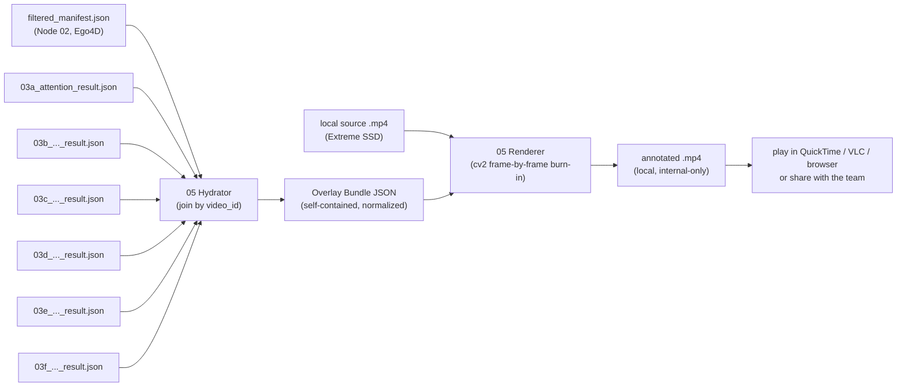

# AI Task Breakdown: Manifest Hydration & Social-Signal Video Renderer

## Objective
Build a **local tool that "hydrates" a clip** — joining the `filtered_manifest.json` produced by
Node 02 with every `03*_result.json` layer output — and **renders an annotated copy of the source
video with all extracted social signals burned into the pixels** (bounding boxes, gaze vectors,
emotion transitions, proxemic approach, nods, flinches), plus a burned-in **signal timeline** and
**live readout panel**. The output is an ordinary `.mp4` you open in **any media player**
(QuickTime, VLC, a browser) — so when you press play, the signals appear **in real time, frame-
accurately synced to the video**, because each signal is drawn onto the exact frame it belongs to.

This is a **QA, debugging, and demo instrument**, not a pipeline-output stage. Its job is to let a
human *see* what the layers saw, so that **silent degradation** (the failure class this project
fights everywhere: an all-`None` export column, a "nod" that is a photocopied window, a box that
drifted onto the wearer's own chin) becomes visible instead of hidden in a JSON array. Because the
output is a self-contained file, it is also trivially **shareable with the team** — no server to
run, no environment to reproduce; just send the `.mp4`.

> **05 is the inverse of 04.** Node 04 *de*hydrates (strips pixels, exports `.parquet` for the
> world). Node 05 *re*hydrates **locally** for the operator — it reads the **local** source videos
> on the Extreme SSD and produces a **local** annotated video. The annotated `.mp4` contains source
> pixels and is therefore **strictly internal**: it must never be uploaded to Hugging Face or any
> public surface, and 05 is **explicitly excluded** from the dehydrated export. Share it only inside
> the team.

---

## 🔒 Locked Design Decisions

These were decided up front (see the original options in the Unresolved Issues history). They are
**locked** and the rest of this document assumes them. Anyone implementing 05 should treat them as
requirements, not suggestions.

| # | Decision | What it means | Why |
|---|---|---|---|
| **D1** | **Offline renderer, not a live web app** | A Python script decodes the video frame-by-frame, draws overlays with **OpenCV (`cv2`)**, and writes a new annotated `.mp4`. There is **no web server, no browser, no JavaScript, no live scrubbing UI.** | Most straightforward to implement (one batch script, no front-end/back-end split) and easiest to share (the output is just a video file). |
| **D2** | **Bystander boxes use "hold-last, then hide"** | Between the sparse (~3–6 s) bystander detections, the renderer keeps drawing the **last known box** for up to `gap_tolerance_sec`, fading it as it ages, then **hides it** rather than guessing where the person moved. **No interpolation, no tracker fill.** | Never fabricates motion the detector never saw; the fade makes "this is stale" legible — the honesty a QA tool requires. |
| **D3** | **Ego4D only** | 05 targets **Ego4D** clips exclusively. Every manifest and every layer result it consumes uses Ego4D UUID `video_id`s (e.g. `0c163d16-8c47-…`). Charades/EPIC/EgoProceL clips are out of scope for the visualizer. | Removes the mixed-ID-namespace join hazard (see Issue 3) and keeps the tool focused on the corpus the real E2E runs actually used. |

> **"Interactivity" under D1.** Because there is no live UI, anything that would have been a UI
> toggle (which layers to show, which people, whether to show phantoms) becomes a **render-time
> command-line flag** that selects what gets burned into the output (see § 2.6). To compare "with
> 03d vs without," you render two files. This is the deliberate trade for D1's simplicity.

---

## 🧭 Where 05 Sits in the Pipeline



The tool has **two cleanly separated parts**:

1. **The Hydrator** (`hydrate.py`) — a pure data-join step. **No video decoding, no rendering.** It
   merges the manifest and all layer results for a `video_id` into a single **Overlay Bundle JSON**:
   a self-contained, display-resolution-independent, time-normalized description of *everything to
   draw*. This is the analog of `rehydrate_dataset.py` (Node 04) but aimed at a renderer rather than
   a researcher's `pandas` frame.
2. **The Renderer** (`render.py`) — reads the bundle + the local source video, decodes it
   **sequentially** frame-by-frame, draws the overlays for each frame's timestamp with `cv2`, writes
   the frames to a new `.mp4`, and (by default) muxes the original audio back in.

Keeping these split means the Hydrator is unit-testable headless (no GPU, no display, no codec), and
the Renderer is a thin, dumb draw routine driven entirely by the bundle.

---

## 📥 Part 1 — The Hydration Step (Data Join)

### 1.1 Inputs

| Input | Source | Notes |
|---|---|---|
| **Manifest** | the per-run `manifest_sub.json` (or equivalent input) the layer run actually consumed | Carries `bystander_detections`, `identified_tasks`, `fps`, `duration_sec`, and the **local** `video_path`. Per **D3**, this is an Ego4D manifest (UUID `video_id`s). |
| **Layer results** | `03a..03f` `*_result.json` files (one record per `video_id`) | Each is an outer list keyed by `video_id`. Missing layers degrade gracefully (the bundle just omits that overlay). |
| **Source video** | local file at `manifest.video_path` (e.g. `/Volumes/Extreme SSD/social_robotics/raw_videos/ego4d/...`) | Decoded by the **Renderer**, not the Hydrator (except a one-shot header probe for dimensions). |
| *(optional)* layer-04 parquet | `social_metadata.parquet` | Only the per-layer `*_raw` JSON-string columns carry the per-frame trace; the scalar summary columns lose it. **Prefer the raw `03*_result.json`.** |

### 1.2 The Join Key (and why D3 de-risks it)

The join key is `video_id`. Historically this was a trap: the toy `filtered_manifest.json` at the
repo root used Charades-style short IDs (`OHLJPEGO`) while the real E2E runs used Ego4D UUIDs
(`0c163d16-8c47-…`), so a result keyed by a UUID would silently fail to join against a short-ID
manifest and produce an empty overlay that *looked* like "the layer found nothing."

**Under D3 (Ego4D only) that specific mismatch cannot happen** — everything is a UUID. The only
residual risk is pointing the Hydrator at the *wrong Ego4D manifest* (a different run/slice that
doesn't contain this clip). So the Hydrator still enforces one simple guard:

- **Fail loudly** if a requested `video_id` is **not found** in the manifest (never emit a blank
  bundle).
- **Warn** (don't silently drop) when a layer result references a `video_id` the manifest lacks, or
  vice-versa.

This is now a cheap sanity check rather than a subtle namespace problem (see simplified Issue 3).

### 1.3 Coordinate Normalization (the alignment-critical part)

Bystander and hand boxes in the manifest are stored as **integer pixel coordinates in the
*original*, full-resolution video frame**, in `[x1, y1, x2, y2]` (top-left, bottom-right) order.
This is verifiable in `src/shared/social_presence.py`: detection runs
`self.model.track(batch_frames, ...)` on the **raw** decoded frames (the only `cv2.resize` in that
file is a 768-px downscale used *solely* for the VLM yes/no check, not for detection), and boxes are
taken as `coords = [int(v) for v in box.xyxy[0].tolist()]` against
`img_h, img_w = batch_frames[i].shape[:2]`.

Consequence: **the box coordinate space is the native video resolution.** The Renderer might draw at
native resolution **or** at a downscaled "share" resolution (`--scale`), so the bundle must not bake
in a pixel size. The **Hydrator normalizes every spatial coordinate to `[0.0, 1.0]`** relative to
native width/height:

```
nx = x_px / native_width        ny = y_px / native_height
```

The bundle records `native_width`/`native_height` (read once via
`cv2.VideoCapture(...).get(CAP_PROP_FRAME_WIDTH/HEIGHT)` — the **one** place the Hydrator touches the
video, and it reads only the header, never decodes frames). At draw time the **Renderer multiplies
normalized coords by the output frame's actual width/height** (`canvas.shape[1]`, `canvas.shape[0]`),
so overlays stay aligned whether output is native or downscaled. **Never** store pixel coordinates in
the bundle.

> **Aspect-ratio note for the renderer.** Because the Renderer writes frames at a single, known size
> (native, or native × `--scale`, preserving aspect ratio), there are no letterbox bars to reason
> about — scaling normalized coords by the output frame size is exact. (Letterboxing only mattered
> for the rejected browser approach.) If a non-aspect-preserving output size is ever added, the
> Renderer must letterbox and offset accordingly.

### 1.4 Temporal Normalization (reconciling cadences)

Every signal lives on a **different temporal grid**, and the Hydrator tags each with its native
cadence and an explicit interpolation policy so the Renderer never guesses. The Renderer computes
the current time of frame `i` as `t = i / fps` and looks signals up at `t`:

| Signal | Native cadence | Render policy at time `t` | Why |
|---|---|---|---|
| Bystander boxes | **sparse, ~3–6 s** (Node 02 samples 1 frame / 3 s; per-track gaps are larger) | **D2: hold-last within `gap_tolerance_sec`, fade with age, else hide** | A box is a discrete observation; interpolating across a 6 s gap invents motion. |
| `attention_trace` (03a) | **dense, ~8 fps** (`sampling_fps_effective: 8.0`, burst 32) | **nearest-sample** (linear on `pitch_rad`/`yaw_rad` allowed for a smooth arrow) | Dense enough to feel continuous; nearest is honest. |
| Emotion slices (03b) | **windowed** (`window_sec` per slice) | **draw while `t ∈ window`** | Defined over an interval, not an instant. |
| Prosody (03c) | **windowed** (`task_reaction_window_sec`) | **draw badge while `t ∈ window`**; loudness bar continuous (Issue 4) | Tone/emotion is per-window. |
| Proxemic (03d) | **windowed** (`measurement_window_sec`) | **draw while `t ∈ window`** | A delta over a window has no per-frame value. |
| Gesture (03e) | **windowed** (`measurement_window_sec`) | **draw + pulse while `t ∈ window`** | Oscillation Hz is a window property; pulse conveys the nod rhythm. |
| Motor resonance (03f) | **windowed** (`reaction_window_sec`) + per-task `ego_kinetic_chaos_score` | **draw while `t ∈ window`**; ego meter during reaction windows | Per-task scalar + per-person verdict. |
| Task climax (02) | **instant** (`task_climax_sec`) | **flash marker for ±`climax_flash_sec`** around it | A single frame-time flag. |

The Renderer **must not** linearly interpolate windowed signals into per-frame values — that would
fabricate a temporal resolution the layer never claimed.

### 1.5 Identity & Color

`person_id` is the bystander track id. The Hydrator assigns each a **stable color** (hash of
`person_id` into a fixed palette in `colors.py`) so the same person is the same color in the box, the
gaze arrow, the emotion label, and the timeline lane.

**Negative `person_id`s are untracked phantoms** — Node 02 assigns an untracked detection a monotonic
**negative** id (see `social_presence.py` `untracked_person_id = -1`), and the Layer 03 "genuine-track
filter" deliberately drops these (docs/03 § Multi-Window Reaction Segments, 03d Resolved #4). The
Hydrator **tags** negative-id tracks `phantom: true`. The Renderer **hides phantoms by default** (so
the burned-in video shows the same genuine tracks the layers scored) and draws them only when
`--show-phantoms` is passed, in a **distinct de-emphasized style** (dashed, low-opacity) so a
suspicious count can be investigated.

### 1.6 The Overlay Bundle Schema

One bundle per `video_id` (the Hydrator can also emit a bundle directory for a whole run). The schema
is the contract between Hydrator and Renderer:

```jsonc
{
  "schema_version": "05.2.0",
  "video_id": "0c163d16-8c47-4773-a25f-2ee57ce9ab87",
  "source_dataset": "ego4d",
  "clip": {
    "video_path": "/Volumes/Extreme SSD/.../0c163d16....mp4",  // local; decoded frame-by-frame by the Renderer
    "native_width": 1920,
    "native_height": 1080,
    "fps": 30.0,
    "duration_sec": 94.53,
    "has_audio": true                 // probed; drives audio mux + "no audio" badge (Issue 4)
  },
  "layers_present": ["02_manifest", "03a", "03c", "03d", "03f"],  // honest list; missing = overlay omitted
  "people": {
    "0":  { "color": "#4FC3F7", "phantom": false },
    "-12":{ "color": "#9E9E9E", "phantom": true }
  },

  // ---- TRACKS: per-person spatial + per-person windowed verdicts -------------
  "tracks": [
    {
      "person_id": 0,
      "boxes": [                       // normalized [0..1], sparse, hold-last (D2)
        { "t": 6.0,  "box": [0.038, 0.0,   0.150, 0.248], "conf": 0.80 },
        { "t": 12.0, "box": [0.240, 0.167, 0.472, 0.840], "conf": 0.57 }
      ],
      "gap_tolerance_sec": 4.0,        // D2: hide box if (t - last_sample_t) exceeds this

      "attention": {                   // 03a, dense
        "summary": { "average_attention_score": 0.21, "is_engaged": false,
                     "gaze_target_classification": "Camera",
                     "peak_engagement_timestamp_sec": 11.75 },
        "trace": [                     // ~8 fps; nearest-sample lookup
          { "t": 4.00, "score": 0.0, "pitch_rad": 0.0, "yaw_rad": 0.0,
            "head_pitch_rad": null, "head_yaw_rad": null, "target": "NoFace" }
        ]
      },

      "windows": [                     // 03b/03d/03e/03f per-person verdicts, each a timeline band
        { "layer": "03b", "window_sec": [66.0, 66.33], "kind": "emotion_slice",
          "transition_pair": ["sadness", "sadness"], "classified_direction": "neutral",
          "terminal_magnitude": 0.68, "segment_index": 0 },
        { "layer": "03d", "window_sec": [84.0, 108.0], "kind": "proxemic",
          "classified_action": "Approach_Intervention", "proxemic_vector": 0.0,
          "bbox_scale_delta_pct": 134.62, "proxemic_confidence": 0.0,
          "window_source": "bystander_anchored" },
        { "layer": "03e", "window_sec": [-2.0, 5.0], "kind": "gesture",
          "gesture_detected": "affirming_nod", "pitch_oscillation_hz": 0.79,
          "yaw_oscillation_hz": 0.0, "confidence": 1.0, "window_source": "bystander_anchored" },
        { "layer": "03f", "window_sec": [49.57, 51.57], "kind": "motor_resonance",
          "motor_resonance_detected": false, "bystander_pose_velocity_peak": 6.9,
          "mirroring_detected": false, "resonance_delay_sec": 0.0 }
      ]
    }
  ],

  // ---- TASK TIMELINE: climax markers + reaction windows + multi-window segments
  "tasks": [
    { "task_id": "t_01", "task_label": "jobs related to construction/renovation",
      "task_velocity": "medium", "task_confidence": 1.0,
      "climax_sec": 48.57, "climax_method": "optical_flow_peak_only",
      "optical_flow_peak_magnitude": 26.42,
      "reaction_windows_sec": [[49.57, 51.57]],   // one per multi-window segment (docs/02 §3)
      "ego_kinetic_chaos_score": 1.0 }             // 03f, per task (wearer)
  ],

  // ---- CLIP-LEVEL audio (03c, one per task reaction window) ------------------
  "audio": [
    { "task_id": "t_01", "window_sec": [49.57, 51.57], "audio_present": true,
      "classified_acoustic_tone": "Neutral", "dominant_emotion": "neutral",
      "dominant_emotion_confidence": 0.0, "max_amplitude_dbFS": -22.4,
      "pitch_contour_variance": 0.0,
      "audio_events": [] }
  ],

  // ---- optional, only if Issue 4 picks the loudness bar: precomputed envelope -
  "audio_envelope": null,            // or { "hz": 20, "rms_dbfs": [-60, -58, ...] } sampled across duration

  // ---- optional: hand boxes (manifest hand_detections) -----------------------
  "hands": [ { "t": 0.0, "boxes": [[0.223, 0.369, 0.336, 0.569]] } ]
}
```

Design rules baked into the schema:
- **Self-contained.** No cross-file references at render time; the Renderer needs only the bundle +
  the video. A bundle can be archived next to a run for later re-render.
- **Honest about provenance.** `layers_present` and `window_source` are surfaced so the operator can
  *see* when a window was re-anchored to the nearest bystander detection (`"bystander_anchored"`) vs
  the strict reaction window (`"reaction_window"`) — the exact distinction the Shared Bystander-Window
  helper makes (docs/03 § Shared Helper). An overlay that hides re-anchoring would mislead.
- **Resolution-independent.** All spatial coords normalized; the Renderer scales to its output size.
- **Degrades cleanly.** Any absent layer/field simply produces no overlay for it.
- **Pre-sorted.** Every per-time array (`boxes`, `attention.trace`, `hands`, `audio_envelope`) is
  emitted **sorted by `t`** so the Renderer can binary-search, never sort.

### 1.7 Hydrator API (proposed)

```python
# src/layer_05_visualizer/hydrate.py
def build_overlay_bundle(
    video_id: str,
    manifest_path: str | Path,
    results_dir: str | Path,           # dir containing 03*_result.json
    *,
    probe_video: bool = True,          # read native W/H/fps/has_audio from the file header
    include_phantoms: bool = True,     # keep negative-id tracks (tagged phantom; Renderer hides by default)
) -> dict: ...

def write_bundles_for_run(
    manifest_path, results_dir, out_dir, *, video_ids: list[str] | None = None
) -> list[Path]: ...   # one <video_id>.bundle.json per clip, plus an index.json
```

The Hydrator is **pure + headless** (except the optional one-shot header probe) and therefore fully
unit-testable: feed it fixture JSON, assert the bundle. See § Verification.

---

## 🎬 Part 2 — The Renderer (Offline `cv2` Burn-In)

### 2.1 What it produces

For one bundle, the Renderer writes **one annotated `.mp4`** the same length and frame rate as the
source, with overlays drawn onto every frame and (by default) the original audio preserved. Playing
it in any media player reproduces the "signals appear in real time as the video plays" experience —
the synchronization is guaranteed because each signal was drawn onto the precise frame at its
timestamp. There is no live UI; *what* gets drawn is fixed at render time by CLI flags (§ 2.6).

### 2.2 The render pipeline (exact steps)

```python
# src/layer_05_visualizer/render.py  (pseudocode — implementation target)
def render_clip(bundle, video_path, out_path, *, scale=1.0, layers="all",
                people=None, show_phantoms=False, panels=("timeline","readout"),
                with_audio=True):
    cap = cv2.VideoCapture(str(video_path))
    src_fps = bundle["clip"]["fps"]                  # trust the bundle; fall back to CAP_PROP_FPS
    in_w, in_h = bundle["clip"]["native_width"], bundle["clip"]["native_height"]
    out_w, out_h = round(in_w * scale), round(in_h * scale)

    # Pre-build fast lookups once (sorted arrays -> bisect): per-person box times,
    # per-person trace times, window interval lists, task markers, audio windows.
    index = build_render_index(bundle, layers, people, show_phantoms)

    fourcc = cv2.VideoWriter_fourcc(*"mp4v")         # widely compatible; 'avc1' if available
    tmp_silent = out_path.with_suffix(".silent.mp4")
    writer = cv2.VideoWriter(str(tmp_silent), fourcc, src_fps, (out_w, out_h))

    frame_idx = 0
    while True:
        ret, frame = cap.read()                      # SEQUENTIAL read -> no random SSD seeks
        if not ret:
            break
        if scale != 1.0:
            frame = cv2.resize(frame, (out_w, out_h), interpolation=cv2.INTER_AREA)
        t = frame_idx / src_fps
        canvas = compose_frame(frame, index, t, out_w, out_h, panels)
        writer.write(canvas)
        frame_idx += 1

    writer.release(); cap.release()

    if with_audio and bundle["clip"]["has_audio"]:
        mux_audio(tmp_silent, video_path, out_path)  # ffmpeg; copies original audio (Issue 4 Option A)
        tmp_silent.unlink()
    else:
        tmp_silent.rename(out_path)
```

- **Sequential decode is the key performance win of D1.** Reading start-to-finish never random-seeks
  the external SSD, so the laggy-scrub concern that haunted the rejected web approach disappears
  entirely (see simplified Issue 4).
- **Audio mux** (when `has_audio` and `--with-audio`, the default — pending Issue 4):
  ```
  ffmpeg -y -i <tmp_silent.mp4> -i <original.mp4> \
         -map 0:v:0 -map 1:a:0 -c:v copy -c:a aac -shortest <out.mp4>
  ```
  This copies the **original** audio track onto the annotated video so you *hear* the bystander
  while *seeing* the flinch. `-shortest` guards against tiny duration drift. If the source has no
  audio stream, skip muxing and emit a silent file (the on-frame "no audio" badge already says so).
- **Resumability** (project convention): if `out_path` already exists and `--force` is not set, skip
  the clip. Long batch renders should run under `caffeinate`/`tools/run_supervised.sh` like every
  other multi-hour job (docs/03 § Running Long Layer Batches).

### 2.3 Frame Layout (what `compose_frame` draws)

Default output = the source frame at native (or `--scale`) size, with overlays and **two translucent
burned-in panels**. Panels are drawn with `cv2.addWeighted` over a copy so the video stays partly
visible beneath them.

```
┌──────────────────────────────────────────────────────────────┐
│  ░ READOUT PANEL (top-left, translucent) ░                    │
│  t=48.6s  ego-chaos ▓▓▓▓░ 1.0                                 │
│  P0  attn 0.21  target:Camera                                 │
│  tone:Neutral  (no audio)                                     │
│                                                                │
│            ┌─ P0 ─┐                                            │
│            │  ↗ gaze   ◜engagement ring                        │
│            │ [face]  sad→happy                                 │
│            └───────┘                                           │
│                              ◆ climax flash                    │
│                                                                │
│ ░ TIMELINE STRIP (bottom, translucent, full width) ░          │
│ task │      ◆48.6      ▭[49.6–51.6]                            │
│ 03a  │ ▁▂▃▅▇▅▃ engagement                                     │
│ 03d  │      ▭▭▭▭▭▭▭ Approach [84–108]      │playhead          │
│ 03e  │           ▭ nod 0.79Hz              ▎                   │
└──────────────────────────────────────────────────────────────┘
```

- **Readout panel** (top-left): the live numeric state at `t` — current time, per-visible-person
  attention/target, ego-chaos meter, active acoustic tone. Skipped if `readout` not in `--panels`.
- **Timeline strip** (bottom, full width): a horizontal time axis `[0, duration]` with one **lane per
  layer**; events drawn at `x = (event_t / duration) * strip_width`; a **vertical playhead** at the
  current `t`. Because it's burned into every frame, the played video shows the playhead sweeping the
  timeline. Skipped if `timeline` not in `--panels`.
- **On-video overlays**: boxes, gaze arrows, engagement rings, per-person window badges, climax
  flashes — drawn directly on the frame in the person's color.

All panel/overlay sizes (font scale, line thickness, panel height, arrow length) are computed as
**fractions of the output frame height** so they look right at native or downscaled resolution.

### 2.4 The Per-Frame Draw Routine (`compose_frame`)

```
def compose_frame(frame, index, t, W, H, panels):
    canvas = frame.copy()

    # --- per-person on-video overlays ---
    for track in index.tracks:                     # phantoms already filtered unless --show-phantoms
        s = last_sample_at_or_before(track.boxes, t)          # bisect
        if s is None: continue
        age = t - s.t
        if age > track.gap_tolerance_sec: continue            # D2: hide stale
        alpha = fade(age)                                     # 1.0 fresh -> ~0.3 near tolerance
        x1,y1,x2,y2 = denorm(s.box, W, H)
        draw_box(canvas, (x1,y1,x2,y2), track.color, alpha, conf=s.conf, label=f"P{track.id}")
        face = (int((x1+x2)/2), y1)                           # top-center as face anchor

        if "03a" in index.layers and track.attention:
            g = nearest_sample(track.attention.trace, t)      # bisect
            draw_gaze_arrow(canvas, face, g.pitch_rad, g.yaw_rad, g.score, g.target, color=track.color)
            draw_engagement_ring(canvas, (x1,y1,x2,y2), track.attention.summary)

        for w in track.windows:                               # 03b/03d/03e/03f badges
            if w.layer in index.layers and within(t, w.window_sec):
                draw_window_badge(canvas, (x1,y1,x2,y2), w, t)   # dispatch by w.kind

    # --- task-level (wearer) overlays ---
    for task in index.tasks:
        if abs(t - task.climax_sec) <= CLIMAX_FLASH_SEC: draw_climax_flash(canvas, W, H, task)
    ego = active_ego_chaos(index.tasks, t)                    # value if t in a reaction window else None

    # --- burned panels ---
    if "readout"  in panels: draw_readout_panel(canvas, index, t, ego)
    if "timeline" in panels: draw_timeline_strip(canvas, index, t)
    return canvas
```

- `last_sample_at_or_before` / `nearest_sample` are **binary searches** (Python `bisect`) over the
  pre-sorted bundle arrays — O(log n) per track per frame.
- `denorm(box, W, H)` = `[round(nx*W), round(ny*H), ...]`.
- `fade(age)` makes a held box visibly stale (the D2 honesty signal) — e.g. linear from 1.0 at age 0
  to 0.3 at `gap_tolerance_sec`.
- Never accumulate a clock; `t` is always `frame_idx / fps`, so audio and overlays cannot drift.

### 2.5 Per-Layer Rendering Spec (the visual language)

Each layer has a deliberate `cv2` encoding. `color` is the person's BGR (hex→BGR via `colors.py`).

- **02 Manifest — bystander boxes & hands.** `cv2.rectangle(..., LINE_AA)` per person, label `P{id}`
  + detection confidence on a filled label chip (`cv2.rectangle` background + `cv2.putText`).
  Phantoms (only with `--show-phantoms`): dashed border (manual dashed-line helper) at low alpha. A
  small "Δt {age}s" tag on a held (stale) box. Hand boxes (with `03a`/`--layers` opt-in): thin
  secondary rectangles.

- **03a Attention / Gaze.** From the face anchor (top-center of the box), draw a **gaze arrow** via
  `cv2.arrowedLine`. Projection of the L2CS Euler angles to screen (image y points **down**):
  ```
  L  = GAZE_ARROW_FRAC * box_height          # scale arrow to face size
  dx = -L * sin(yaw)  * cos(pitch)
  dy = -L * sin(pitch)
  tip = (face_x + dx, face_y + dy)           # cv2.arrowedLine(canvas, face, tip, color, ...)
  ```
  An **engagement ring** (`cv2.circle`/`cv2.ellipse`) around the head, radius ∝ box size, color
  lerped **red→green** by `score`, thickness ∝ `score`. Label the `target` (`Camera`/`NoFace`/
  `Away`). When `head_pitch_rad`/`head_yaw_rad` are present (head-pose mode — the signal 03e actually
  trusts, docs/03e Resolved #11), draw a second, dashed arrow from the head-pose angles. The 03a
  timeline lane shows a per-person engagement sparkline.

- **03b Reasonable Emotion.** While `t ∈ window_sec`, render the `transition_pair` above the box as
  `from → to` (e.g. `sad → happy`), colored by `classified_direction` (approving=green,
  skeptical/negative=red, neutral=gray), label weight/opacity ∝ `terminal_magnitude`. Because slices
  form a **trajectory** across a task (docs/03 § Multi-Window Reaction Segments), the 03b lane shows
  the ordered slices so the operator reads the arc ("skeptical → approving"), not an average.

- **03c Acoustic Prosody.** While `t ∈ task reaction window`, a badge in the readout panel shows
  `classified_acoustic_tone` + `dominant_emotion` (+ confidence). When `audio_present == false`
  (common — many clips are silent; 03c emits `-100 dBFS`, all-zero emotions), show an explicit **"no
  audio"** chip instead of a misleading flat-zero bar. The optional **loudness bar** (a vertical bar
  rising/falling with `audio_envelope.rms_dbfs` at `t`) is gated on Issue 4.

- **03d Proxemic Kinematics.** While `t ∈ measurement_window_sec`, draw an **approach/avoidance
  arrow** on the box — pointing toward the camera/viewer (Approach_Intervention) or away (Avoidance) —
  sized by `bbox_scale_delta_pct` (growing bbox ⇒ approaching). Badge `classified_action` +
  `proxemic_confidence`, and **flag `window_source`** so a `bystander_anchored` (re-anchored) window
  is visually distinct from a strict `reaction_window`. The (often long) window shows as a band in
  the 03d lane.

- **03e Affirmation Gesture.** While `t ∈ gesture window`, a **nod/shake icon that pulses at
  `pitch_oscillation_hz`** — `size = base * (1 + 0.3*sin(2π * f * t))`, so a detected nod literally
  bobs at its frequency — labeled with the Hz + `confidence`. Render **head-pose** gestures
  emphatically (the trusted signal) and any gaze-derived ones, if present, as explicitly-untrusted
  (mirroring docs/03e's discard of gaze gestures). `interpolated_fraction` shown as a small
  data-quality tick so a heavily-interpolated nod reads as less certain.

- **03f Motor Resonance.** A wearer-level **ego-kinetic-chaos meter** (`ego_kinetic_chaos_score`, per
  task) in the readout panel — "how violently is the camera/wearer moving right now." Per person, a
  **flinch/startle border flash** when `motor_resonance_detected`, and a **mirroring** glyph when
  `mirroring_detected`; `bystander_pose_velocity_peak` as a spike in the 03f lane. If
  `resonance_delay_sec > 0`, draw a connector from the ego-spike instant to the bystander reaction to
  visualize the sympathetic lag.

- **02 Task layer.** `◆ climax` diamond on the timeline at `task_climax_sec` (and a brief on-video
  flash for ±`climax_flash_sec`), a shaded **reaction-window band** per multi-window segment, label =
  `task_label` + `task_velocity`.

### 2.6 Render-time configuration (replaces the live toggles)

Under D1 there is no UI, so selection happens via flags that decide **what gets burned in**:

| Flag | Effect | Default |
|---|---|---|
| `--layers 03a,03d` / `--layers all` | which layers' overlays to draw | `all` present |
| `--people 0,3` | restrict to specific `person_id`s | all genuine |
| `--show-phantoms` | also draw negative-id phantom tracks (de-emphasized) | off |
| `--panels timeline,readout` / `--panels none` | which burned panels to include | both |
| `--scale 0.5` | downscale output (smaller, faster, easy to share) | `1.0` (native) |
| `--with-audio` / `--no-audio` | mux original audio into the output (Issue 4) | on if `has_audio` |
| `--clip-range 40:60` | render only `t ∈ [40s, 60s]` (fast iteration on one moment) | full clip |
| `--force` | re-render even if the output exists | off (skip existing) |

To compare "with vs without a layer," render two files (e.g. `…__all.mp4` and `…__no03d.mp4`). The
output filename should encode the salient flags for traceability, e.g.
`<video_id>__L-all__s50.mp4`.

### 2.7 Performance & output expectations

- **No seek penalty.** Sequential decode means the external-SSD latency that motivated a proxy in the
  web design is moot. The drive is read once, linearly.
- **Render cost** ≈ decode + a handful of `cv2` draw calls + encode per frame; expect **roughly a
  small multiple of real time** per clip on the M4 Max (dominated by decode/encode, not the
  microsecond bisect lookups). `--scale 0.5` and `--clip-range` cut this sharply for iteration.
- **Output size**: an H.264 re-encode at native res is comparable to the source; `--scale` shrinks it
  for sharing. Keep outputs on internal disk or a dedicated `e2e_reports/<run>/viz/` dir.
- **Determinism**: same bundle + same flags ⇒ byte-similar output (modulo encoder), so renders are
  reproducible for review.

---

## 🗂️ Part 3 — Module & File Layout

```
src/layer_05_visualizer/
├── __init__.py
├── hydrate.py            # build_overlay_bundle(), write_bundles_for_run()  — pure/headless
├── bundle_schema.py      # schema constants + validate_bundle() guard (no silent shape drift)
├── colors.py             # stable person_id -> color palette hashing; hex -> BGR
├── render.py             # render_clip(), compose_frame(), build_render_index(), mux_audio()
└── draw/                 # per-layer cv2 draw helpers (one concern each)
    ├── boxes.py          # draw_box (+ dashed phantom, stale Δt tag), hands
    ├── gaze.py           # 03a: draw_gaze_arrow, draw_engagement_ring
    ├── emotion.py        # 03b: transition badge
    ├── prosody.py        # 03c: tone chip, "no audio" chip, optional loudness bar
    ├── proxemic.py       # 03d: approach/avoidance arrow + window_source flag
    ├── gesture.py        # 03e: pulsing nod/shake icon
    ├── motor.py          # 03f: ego-chaos meter, flinch flash, mirroring glyph
    ├── timeline.py       # bottom timeline strip + playhead
    └── panels.py         # readout panel, legend, fonts/scale helpers

tools/
└── run_visualizer.py     # CLI: hydrate (if needed) -> render one clip or batch a whole run dir
```

This mirrors the existing per-node layout (`src/layer_04_dehydrated_export/` has `aggregator.py`,
`per_layer.py`, `rehydrate_dataset.py`, `huggingface_upload.py`). Tests go in
`tests/test_layer_05.py` (Hydrator + bundle + single-frame draw asserts). `cv2` and `ffmpeg` are
already project dependencies (used across Layer 02/03 and the docs).

---

## 🚀 Part 4 — Running It

```bash
# 1. Hydrate a finished Ego4D run into Overlay Bundles (headless; safe anywhere)
./venv/bin/python -m src.layer_05_visualizer.hydrate \
    --manifest   e2e_reports/2026_06_14_layer03e_headpose/manifest_sub.json \
    --results-dir e2e_reports/2026_06_14_layer03e_headpose \
    --out-dir    e2e_reports/2026_06_14_layer03e_headpose/bundles

# 2. Render an annotated .mp4 for one clip
./venv/bin/python -m src.layer_05_visualizer.render \
    --bundle     e2e_reports/2026_06_14_layer03e_headpose/bundles/0c163d16-....bundle.json \
    --out        e2e_reports/2026_06_14_layer03e_headpose/viz/0c163d16-....__L-all.mp4 \
    --layers all --panels timeline,readout

# 2b. Iterate fast on just the climax moment, downscaled:
#     --clip-range 47:53 --scale 0.5

# 3. Batch a whole run in one shot (hydrate + render every clip)
./venv/bin/python tools/run_visualizer.py \
    --manifest    e2e_reports/<run>/manifest_sub.json \
    --results-dir e2e_reports/<run> \
    --out-dir     e2e_reports/<run>/viz \
    --layers all
# wrap long batches: tools/run_supervised.sh e2e_reports/<run>/viz/_done.json <the command above>

# 4. Open the .mp4 in QuickTime / VLC / a browser — signals play in real time. Share the file.
```

Runs in the main `venv` (it already has `cv2`; `ffmpeg` is on PATH for the audio mux). Everything is
local; **the annotated `.mp4` is internal-only and must never be uploaded** (see Objective + Issue
on export exclusion).

---

## ✅ Verification & Validation Check

A misaligned or mistimed overlay is itself a silent lie, so the tool's own correctness is testable:

1. **Box-at-`t` spot check (headless).** For a known clip, assert `last_sample_at_or_before(boxes, ts)`
   returns the exact manifest box at each detection timestamp, and that normalize→denormalize
   round-trips back to the manifest integers (±1 px). `tests/test_layer_05.py`.
2. **Single-frame render assert (headless).** Call `compose_frame` on a synthetic 100×100 frame with
   a known box and assert the box-border color appears at the expected pixels (and that a stale box
   past `gap_tolerance_sec` is absent). Proves D2 + the denorm math without encoding a whole video.
3. **Synthetic full-frame fixture.** A bundle whose box is `[0,0,1,1]` and gaze arrow is axis-aligned;
   render a few frames and confirm the box traces the frame edge and the arrow points cardinally —
   proves scaling at native and at `--scale 0.5`.
4. **Audio mux check.** After rendering a clip whose source has audio, `ffprobe` the output and assert
   it has one audio stream of (near-)equal duration; a silent source yields a video with no audio
   stream and an on-frame "no audio" badge.
5. **Provenance honesty.** Confirm a `bystander_anchored` window is visually distinguishable from a
   `reaction_window` one, and that omitting `--show-phantoms` removes exactly the negative-id tracks.
6. **No-pixel-export guard.** A test asserts the Renderer writes only into the configured local
   `viz/` output path and **never** into the dehydrated-export directory — 05 must not leak source
   pixels into 04's published surface.

---

## 🧪 Resolved Issues & Implementation Refinements

_None yet — Layer 05 is at the design stage. The locked decisions (D1 offline renderer, D2 hold-last,
D3 Ego4D-only) are recorded in § Locked Design Decisions; once implemented and verified, refinements
will be migrated here per the Bug Documentation Style Guide._

## ⚠️ Unresolved Issues & Suggestions

### Issue 3: Make sure you point at the right manifest (simplified for re-review)
**Status**: ⚠️ Open for your re-review — **mostly de-risked by D3 (Ego4D only).** In plain terms: the
old danger was that two ID styles existed (Charades's short codes like `OHLJPEGO` vs Ego4D's long IDs
like `0c163d16-…`). If you accidentally paired layer results from one style with a manifest in the
other, the clip wouldn't be found and you'd get a **blank video that looks like "the layers found
nothing"** — a silent failure. **Now that 05 only handles Ego4D, both sides always use the same ID
style, so that specific mix-up can't happen.** The only thing left: you could still point the tool at
the *wrong Ego4D manifest* — one from a different batch that simply doesn't include this clip. The fix
for that is small and not really a "hard problem" anymore.

**Option A (recommended)**: **Just add a loud sanity check.** When the Hydrator can't find a clip's ID
in the manifest, it stops and prints a clear error ("video_id X not in manifest Y — wrong manifest?")
instead of producing a blank video.
  - *Pros*: One cheap check; impossible to get a silent blank; no changes anywhere else.
  - *Cons*: Still relies on you pointing at the right run folder (but the error tells you immediately
    when you didn't).

**Option B**: **Also stamp the manifest into each result file.** Have the layer runners record which
manifest they used, so the Hydrator can double-check the pairing automatically.
  - *Pros*: The tool can self-verify the match; useful beyond the visualizer.
  - *Cons*: Requires editing every Layer 03 runner (work outside 05); only helps for *future* runs.

Your selection: _____

---

### Issue 4: Sound in the annotated video (simplified for re-review)
**Status**: ⚠️ Open for your re-review — **simpler than before, because D1 removed the scrubbing
problem.** Plain terms: with the offline approach we read the video straight through once and save a
small finished clip, so the old "laggy when you drag the scrubber on the external drive" worry is
gone — the saved clip plays smoothly anywhere. The only remaining question is just: **do you want to
hear the original audio in the annotated video?**

**Option A (recommended)**: **Keep the original sound (and optionally a little loudness bar).** After
drawing the overlays, copy the original audio track into the saved clip (one `ffmpeg` command). You'd
*hear* the bystander's "wow!" while *seeing* the flinch. Optionally also draw a small bar that rises
and falls with how loud the audio is.
  - *Pros*: Most informative — sound is half the social signal; trivial to add (one ffmpeg step);
    clips with no audio just come out silent with a "no audio" label.
  - *Cons*: Slightly larger output file; one extra dependency on `ffmpeg` (already installed).

**Option B**: **No sound — picture only.** Save a silent annotated clip and rely on the on-screen text
labels (e.g. "tone: surprised") to convey what the audio layer found.
  - *Pros*: Simplest possible; no audio handling at all.
  - *Cons*: You lose the actual audio, which is often the most visceral part of a reaction.

> Note: many Ego4D clips have **no audio at all** (the prosody layer reports `audio_present: false`).
> In that case both options produce a silent video with a clear **"no audio"** badge — no flat/fake
> meter.

Your selection: _____
