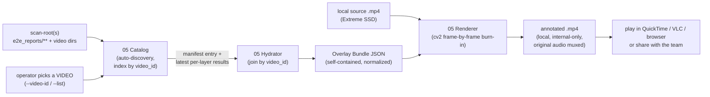

# AI Task Breakdown: Manifest Hydration & Social-Signal Video Renderer

## Objective
Build a **local tool that "hydrates" a clip** — joining the `filtered_manifest.json` produced by
Node 02 with every `03*_result.json` layer output — and **renders an annotated copy of the source
video with all extracted social signals burned into the pixels** (bounding boxes, gaze vectors,
emotion transitions, proxemic approach, nods, flinches), plus a burned-in **signal timeline** and
**live readout panel**. The output is an ordinary `.mp4` you open in **any media player**
(QuickTime, VLC, a browser) — so when you press play, the signals appear **in real time, frame-
accurately synced to the video**, because each signal is drawn onto the exact frame it belongs to.

This is a **QA, debugging, and demo instrument**, not a pipeline-output stage. Its job is to let a
human *see* what the layers saw, so that **silent degradation** (the failure class this project
fights everywhere: an all-`None` export column, a "nod" that is a photocopied window, a box that
drifted onto the wearer's own chin) becomes visible instead of hidden in a JSON array. Because the
output is a self-contained file, it is also trivially **shareable with the team** — no server to
run, no environment to reproduce; just send the `.mp4`.

> **05 is the inverse of 04.** Node 04 *de*hydrates (strips pixels, exports `.parquet` for the
> world). Node 05 *re*hydrates **locally** for the operator — it reads the **local** source videos
> on the Extreme SSD and produces a **local** annotated video. The annotated `.mp4` contains source
> pixels and is therefore **strictly internal**: it must never be uploaded to Hugging Face or any
> public surface, and 05 is **explicitly excluded** from the dehydrated export. Share it only inside
> the team.

---

## 🔒 Locked Design Decisions

These were decided up front (see the original options in the Unresolved Issues history). They are
**locked** and the rest of this document assumes them. Anyone implementing 05 should treat them as
requirements, not suggestions.

| # | Decision | What it means | Why |
|---|---|---|---|
| **D1** | **Offline renderer, not a live web app** | A Python script decodes the video frame-by-frame, draws overlays with **OpenCV (`cv2`)**, and writes a new annotated `.mp4`. There is **no web server, no browser, no JavaScript, no live in-browser scrubbing player.** (D1 forbids a *web-app playback* surface; it does **not** forbid a tiny local *selection* helper — see D6.) | Most straightforward to implement (one batch script, no front-end/back-end split) and easiest to share (the output is just a video file). |
| **D2** | **Bystander boxes use "hold-last, then hide"** | Between the sparse (~3–6 s) bystander detections, the renderer keeps drawing the **last known box** for up to `gap_tolerance_sec`, fading it as it ages, then **hides it** rather than guessing where the person moved. **No interpolation, no tracker fill.** | Never fabricates motion the detector never saw; the fade makes "this is stale" legible — the honesty a QA tool requires. |
| **D3** | **Ego4D only** | 05 targets **Ego4D** clips exclusively. Every manifest and every layer result it consumes uses Ego4D UUID `video_id`s (e.g. `0c163d16-8c47-…`). Charades/EPIC/EgoProceL clips are out of scope for the visualizer. | Removes the mixed-ID-namespace join hazard and keeps the tool focused on the corpus the real E2E runs actually used. |
| **D4** | **Video-first selection — you pick a video, not a manifest** | The operator's only selection input is **a video** (a `video_id`, or a pick from a printed catalog of available clips). The tool then **auto-discovers** every manifest entry and every `03*_result.json` related to that video and assembles them itself. The operator **never** types a manifest path. | The operator should not have to know which run folder holds which layer's result; "show me everything you know about *this clip*" is the natural mental model and eliminates the wrong-manifest mistake at the source. (Supersedes the original Issue 3 options.) |
| **D5** | **Keep the original audio (+ optional loudness bar)** | The annotated `.mp4` carries the **original audio track** (copied in with one `ffmpeg` step) so you *hear* the reaction while *seeing* it, plus an optional on-frame loudness bar. Clips Ego4D ships with no audio come out silent with a clear **"no audio"** badge. | Sound is half of a social reaction; muxing it back is trivial and far more informative than picture-only. (Was Issue 4 → Option A.) |
| **D6** | **Findings-aware terminal selector (default); Tkinter window is opt-in** | You don't type a `video_id` from memory. Running with **no video flag** prints a **findings-sorted, numbered table** of discovered clips (`★` count · task · which layers fired · audio · `video_id`) and prompts: type a **number** to render, **`/text`** to filter (e.g. `/03e`), **`/clear`**, or **`q`**. Pure stdin/stdout — **no GUI, no dependency, works over SSH/anywhere**. A Tkinter table window (`--gui`) is kept as an *option*, but it is **not the default** because the macOS *system* Tk (8.5.9) cannot render `ttk.Treeview` rows — the window comes up blank even with the `clam` theme (confirmed on this host). | "I can't remember a UUID, and I want to pick the clip where something actually happened." The terminal table shows the same columns + findings ranking with zero rendering risk; it cannot come up blank. Compatible with D1 (a *selection* helper, not a playback UI). |

> **"Interactivity" under D1.** Because there is no live *playback* UI, anything that would have been a
> UI toggle (which layers to show, which people, whether to show phantoms) becomes a **render-time
> command-line flag** that selects what gets burned into the output (see § 2.6). To compare "with 03d
> vs without," you render two files. This is the deliberate trade for D1's simplicity.
>
> **What "selecting a video" means (D4 + D6).** You never type a manifest path, and normally you don't
> type a `video_id` either. Run the tool with no video given and it shows the **findings-aware terminal
> selector** (D6): a numbered, findings-sorted table; type a **number** to render, **`/text`** to
> filter, **`q`** to quit. (`--gui` opts into the Tkinter window; `--video-id`, `--video <file>`, and
> the non-interactive `--list` remain available for scripting/CI.) The *"viewer"* in which the signals
> "populate" is the **rendered annotated `.mp4`** — once you pick a clip, every signal the tool
> discovered for it is burned in and plays back, with sound, in any media player. **`--verify`** runs
> the whole pipeline on one clip and prints PASS/FAIL as a self-test. See § 1.2 for discovery + the
> findings model, and § 4 for the commands.

---

## 🧭 Where 05 Sits in the Pipeline



The **Catalog** is the answer to D4: it scans the configured location(s), indexes every `video_id`
it can find across all manifests and `03*_result.json` files, and — when the operator names a video —
hands the Hydrator the manifest entry plus the latest result from each layer. The operator never
points at a manifest or a result file; they point at a **video**.

The tool has **two cleanly separated parts**:

1. **The Hydrator** (`hydrate.py`) — a pure data-join step. **No video decoding, no rendering.** It
   merges the manifest and all layer results for a `video_id` into a single **Overlay Bundle JSON**:
   a self-contained, display-resolution-independent, time-normalized description of *everything to
   draw*. This is the analog of `rehydrate_dataset.py` (Node 04) but aimed at a renderer rather than
   a researcher's `pandas` frame.
2. **The Renderer** (`render.py`) — reads the bundle + the local source video, decodes it
   **sequentially** frame-by-frame, draws the overlays for each frame's timestamp with `cv2`, writes
   the frames to a new `.mp4`, and (by default) muxes the original audio back in.

Keeping these split means the Hydrator is unit-testable headless (no GPU, no display, no codec), and
the Renderer is a thin, dumb draw routine driven entirely by the bundle.

---

## 📥 Part 1 — The Hydration Step (Data Join)

### 1.1 What the operator provides vs. what the tool discovers (D4)

Under **D4** the operator provides only **a video selection** + **where to look**. Everything else —
which manifest holds that clip, which run dir holds each layer's result, where the `.mp4` lives — is
**discovered automatically** by the Catalog (§ 1.2).

| The operator provides | The tool discovers (Catalog) |
|---|---|
| a **video** — `--video-id <uuid>`, or `--video <path>`, or a pick from `--list` | the **manifest entry** for that `video_id` (`bystander_detections`, `identified_tasks`, `fps`, `duration_sec`, `video_path`) |
| one or more **scan roots** — `--scan-root` (defaults to `e2e_reports/` + the configured Ego4D video dirs) | the **latest `03*_result.json`** record for each layer (`03a..03f`) that contains that `video_id` |
| render flags (§ 2.6) | the **local source `.mp4`** (from the manifest's `video_path`, else `<ego4d_video_dir>/<video_id>.mp4`) |

*(Optional, discouraged input: a layer-04 `social_metadata.parquet`. Only its per-layer `*_raw`
JSON-string columns carry the per-frame trace; the scalar summary columns lose it. **Prefer the raw
`03*_result.json`** the Catalog already finds.)*

### 1.2 The Catalog: Video-First Auto-Discovery (D4)

The Catalog is the component that makes "pick a video, not a manifest" real. It is a **headless index
build** that runs before hydration:

**1. Scan.** Walk each `--scan-root` (default: the repo's `e2e_reports/` tree plus the configured
Ego4D video directories from `src/config.py` — `DATASET_PATHS["ego4d"]` / `OUTPUT_DIR/ego4d`).
Collect:
   - every **manifest** file (`manifest_sub.json`, `filtered_manifest.json`, or any JSON that is a
     list of records each having `video_id` + `bystander_detections`);
   - every **layer result** file matching `03*_result.json` (an outer list of records carrying
     `layer` + `video_id`);
   - every **video file** `<uuid>.mp4` (for resolving/validating the source path and for the `--list`
     catalog even when only pixels exist).

**2. Index by `video_id`.** Build `catalog[video_id] = { manifest_entry, results_by_layer, video_path,
sources }`. For each `video_id`:
   - **manifest_entry**: the record from the *most recent* manifest that contains it (mtime-ranked).
     Ego4D `video_id`s are globally unique, so the *content* (tasks, bystanders) is the same across
     runs; recency just picks the freshest copy.
   - **results_by_layer**: for each layer `03a..03f`, the record from the *most recent*
     `03*_result.json` that contains this `video_id`. **This is the key behavior** — a clip's layers
     are routinely spread across different dated run dirs (03a in one, 03d in another, exactly as
     `e2e_reports/` is laid out today), and the Catalog stitches the **best available result per
     layer** into one view. The operator does not need to know where any of them live.
   - **video_path**: prefer `manifest_entry.video_path` if the file exists; else
     `<ego4d_video_dir>/<video_id>.mp4`; else `null` (catalog still lists it, render refuses — see
     guards).
   - **sources**: record which file each piece came from (for `--list --verbose` provenance, so an
     operator *can* audit "03d came from the June 13 run" if they want — transparency without
     requiring a choice).

**3. Compute the per-clip findings summary (D6).** For each indexed clip, derive a compact summary
that drives both the picker and the on-frame readout: for every layer that has a result, a boolean
**"finding"** — did the layer actually detect a social signal, as opposed to running but reporting
nothing — plus a `num_layers_with_findings` count. The per-layer predicate (tunable; defaults below)
keys off the **same fields the renderer draws**, so the picker's `★` count can never disagree with the
burned overlays:

| Layer | "Finding" = true when … | "ran, no finding" looks like |
|---|---|---|
| **03a** attention | `aggregate.any_person_engaged == true` (a bystander actually engaged the camera) | ran, but `is_engaged` false for everyone |
| **03b** emotion | any slice `classified_direction != "neutral"` (a real approving/skeptical shift) | all transitions neutral |
| **03c** prosody | any task `audio_present == true` **and** (`classified_acoustic_tone != "Neutral"` or `dominant_emotion != "neutral"`) | silent clip, or audio but neutral |
| **03d** proxemic | any person `classified_action != "Neutral"` (`Approach_Intervention` / `Avoidance`) | all `Neutral` |
| **03e** gesture | any person `gesture_detected != "none"` (a nod/shake) | all `none`, or `skipped_reason` |
| **03f** motor | any person `motor_resonance_detected == true` **or** `mirroring_detected == true` | neither fired |

Each clip carries `findings = { "03a": "finding" | "ran" | "absent", … }` and
`num_layers_with_findings`. **Three states matter** — *finding* (predicate true), *ran* (result
present, predicate false), *absent* (no result) — because a layer that **ran but found nothing** must
read differently from one that **never ran**. This distinction *is* the anti-silent-degradation
mechanism, surfaced at selection time.

**4. Present & pick (D6).** With no video flag, show the **terminal selector** (default) — a
findings-sorted, numbered table on stdout; type a **number** to render, **`/text`** to filter, **`q`**
to quit:

```
  #   ★  task                     layers w/ findings   aud  video_id
  0   3  Cooking                  03a 03c 03e          yes  143f43b6
  1   3  Cleaning / laundry       03a 03b 03c          yes  43bd06f3
  2   2  Cooking                  03a 03e              yes  0780244d
  …
Filter='' · showing 59/59
Enter a # to visualize · /<text> to filter · /clear · q to quit:
```

The same catalog data is also available non-interactively via **`--list`** (`--json` / `--verbose`),
and — on a host with a **modern** Tcl/Tk — as an opt-in **Tkinter table window** via **`--gui`**
(below). The macOS *system* Tk 8.5.9 renders that window's table blank (see the gotcha in § 3), which
is exactly why the terminal selector is the default rather than the GUI.

*Optional `--gui` window layout (same columns + a live summary panel):*

```
┌─ Select a clip to visualize ─────────────────────────────────────────────┐
│ filter: [ 03e________________ ]   sort:  ▼★   (click a header to re-sort) │
│ ┌───┬──────────────────────────┬──────────────┬───────┬───────┬────────┐ │
│ │ ★ │ task                     │ layers       │ audio │ video │ id     │ │   ← ttk.Treeview
│ ├───┼──────────────────────────┼──────────────┼───────┼───────┼────────┤ │     (sortable cols,
│ │ 3 │ reaction surprised       │ 03c 03e 03f  │  🔊   │   ✓   │630bd4ba│ │      click row to
│ │ 1 │ construction/renovation  │ 03d          │  ··   │   ✓   │0c163d16│ │      preview, double-
│ │ 0 │ cooking eggs (ran, none) │ —            │  🔊   │   ✓   │43bd06f3│ │      click to render)
│ └───┴──────────────────────────┴──────────────┴───────┴───────┴────────┘ │
│ ┌─ summary (selected clip) ──────────────────────────────────────────┐   │
│ │ 630bd4ba-3053-…  ego4d · 62.4s · audio:yes                          │   │
│ │ TASK reaction shot   climax 31.2s   reaction [32.2–34.2]            │   │
│ │ 03e affirming_nod P1 @0.79Hz · 03c surprised · 03f flinch P1        │   │
│ │ 03a ran — no engagement · 03b absent · 03d absent                  │   │
│ └────────────────────────────────────────────────────────────────────┘   │
│                                        [ Cancel ]     [ Render selected ] │
└───────────────────────────────────────────────────────────────────────────┘
```
   - **Table** (`ttk.Treeview`, one row per clip; **default sort = `★ num_layers_with_findings` desc**
     so interesting clips float up). Columns: `★`, `task` (first task summary), `layers` (the
     finding layers, `—` if none), `audio?`, `video?` (file found), `video_id`. **Click any header to
     re-sort** (toggles asc/desc; `★` and duration sort numerically).
   - **Filter box**: typing narrows the table live (matches across all columns; `03e` → only clips
     where the gesture layer fired; a task keyword → group by activity; `noaudio`). This is the
     **categorization** you asked for, as live text-filtering.
   - **Summary panel**: clicking a row fills it with that clip's full summary (`entry.summary_text`) —
     `video_id`, `source_dataset`, `duration_sec`, every `task_label` + `climax_sec` + reaction
     window(s), and the **per-layer findings breakdown**. This is the "summary of the task/video we
     are loading," shown *before* you commit to a multi-minute render.
   - **Render**: **double-click a row** or select it and click **Render selected**; **Cancel** (or
     closing the window) selects nothing and the tool exits without rendering.
   - The non-interactive **`--list`** (optionally `--json` / `--verbose`) prints the same columns to
     stdout without opening a window — for scripting/CI and headless hosts.

**5. Resolve + guard.** When a `video_id` is chosen (via the picker, `--video-id`, or `--video`), the
Catalog returns its entry and the Hydrator builds the bundle from it. Guards (all **loud**, never
silent):
   - **Unknown video** → error `video_id X not found under any --scan-root (Y manifests, Z result
     files scanned)`. Never emit a blank bundle.
   - **No layers found** for a known clip → render is allowed (manifest boxes + tasks still overlay)
     but a prominent warning lists which layers are missing, so an all-`None` clip can't masquerade
     as "nothing happened."
   - **Missing video file** → error naming the paths tried; rendering needs pixels.
   - **`video_id` only in a result, not in any manifest** (orphaned result) → warn and skip that
     result (no geometry to anchor it to).

The join key remains `video_id`; under **D3 (Ego4D only)** every id is a UUID, so the old short-ID-vs-
UUID namespace collision is impossible and discovery is unambiguous.

### 1.3 Coordinate Normalization (the alignment-critical part)

Bystander and hand boxes in the manifest are stored as **integer pixel coordinates in the
*original*, full-resolution video frame**, in `[x1, y1, x2, y2]` (top-left, bottom-right) order.
This is verifiable in `src/shared/social_presence.py`: detection runs
`self.model.track(batch_frames, ...)` on the **raw** decoded frames (the only `cv2.resize` in that
file is a 768-px downscale used *solely* for the VLM yes/no check, not for detection), and boxes are
taken as `coords = [int(v) for v in box.xyxy[0].tolist()]` against
`img_h, img_w = batch_frames[i].shape[:2]`.

Consequence: **the box coordinate space is the native video resolution.** The Renderer might draw at
native resolution **or** at a downscaled "share" resolution (`--scale`), so the bundle must not bake
in a pixel size. The **Hydrator normalizes every spatial coordinate to `[0.0, 1.0]`** relative to
native width/height:

```
nx = x_px / native_width        ny = y_px / native_height
```

The bundle records `native_width`/`native_height` (read once via
`cv2.VideoCapture(...).get(CAP_PROP_FRAME_WIDTH/HEIGHT)` — the **one** place the Hydrator touches the
video, and it reads only the header, never decodes frames). At draw time the **Renderer multiplies
normalized coords by the output frame's actual width/height** (`canvas.shape[1]`, `canvas.shape[0]`),
so overlays stay aligned whether output is native or downscaled. **Never** store pixel coordinates in
the bundle.

> **Aspect-ratio note for the renderer.** Because the Renderer writes frames at a single, known size
> (native, or native × `--scale`, preserving aspect ratio), there are no letterbox bars to reason
> about — scaling normalized coords by the output frame size is exact. (Letterboxing only mattered
> for the rejected browser approach.) If a non-aspect-preserving output size is ever added, the
> Renderer must letterbox and offset accordingly.

### 1.4 Temporal Normalization (reconciling cadences)

Every signal lives on a **different temporal grid**, and the Hydrator tags each with its native
cadence and an explicit interpolation policy so the Renderer never guesses. The Renderer computes
the current time of frame `i` as `t = i / fps` and looks signals up at `t`:

| Signal | Native cadence | Render policy at time `t` | Why |
|---|---|---|---|
| Bystander boxes | **sparse, ~3–6 s** (Node 02 samples 1 frame / 3 s; per-track gaps are larger) | **D2: hold-last within `gap_tolerance_sec`, fade with age, else hide** | A box is a discrete observation; interpolating across a 6 s gap invents motion. |
| `attention_trace` (03a) | **dense, ~8 fps** (`sampling_fps_effective: 8.0`, burst 32) | **nearest-sample** (linear on `pitch_rad`/`yaw_rad` allowed for a smooth arrow) | Dense enough to feel continuous; nearest is honest. |
| Emotion slices (03b) | **windowed** (`window_sec` per slice) | **draw while `t ∈ window`** | Defined over an interval, not an instant. |
| Prosody (03c) | **windowed** (`task_reaction_window_sec`) | **draw badge while `t ∈ window`**; loudness bar continuous (D5) | Tone/emotion is per-window. |
| Proxemic (03d) | **windowed** (`measurement_window_sec`) | **draw while `t ∈ window`** | A delta over a window has no per-frame value. |
| Gesture (03e) | **windowed** (`measurement_window_sec`) | **draw + pulse while `t ∈ window`** | Oscillation Hz is a window property; pulse conveys the nod rhythm. |
| Motor resonance (03f) | **windowed** (`reaction_window_sec`) + per-task `ego_kinetic_chaos_score` | **draw while `t ∈ window`**; ego meter during reaction windows | Per-task scalar + per-person verdict. |
| Task climax (02) | **instant** (`task_climax_sec`) | **flash marker for ±`climax_flash_sec`** around it | A single frame-time flag. |

The Renderer **must not** linearly interpolate windowed signals into per-frame values — that would
fabricate a temporal resolution the layer never claimed.

### 1.5 Identity & Color

`person_id` is the bystander track id. The Hydrator assigns each a **stable color** (hash of
`person_id` into a fixed palette in `colors.py`) so the same person is the same color in the box, the
gaze arrow, the emotion label, and the timeline lane.

**Negative `person_id`s are untracked phantoms** — Node 02 assigns an untracked detection a monotonic
**negative** id (see `social_presence.py` `untracked_person_id = -1`), and the Layer 03 "genuine-track
filter" deliberately drops these (docs/03 § Multi-Window Reaction Segments, 03d Resolved #4). The
Hydrator **tags** negative-id tracks `phantom: true`. The Renderer **hides phantoms by default** (so
the burned-in video shows the same genuine tracks the layers scored) and draws them only when
`--show-phantoms` is passed, in a **distinct de-emphasized style** (dashed, low-opacity) so a
suspicious count can be investigated.

### 1.6 The Overlay Bundle Schema

One bundle per `video_id` (the Hydrator can also emit a bundle directory for a whole run). The schema
is the contract between Hydrator and Renderer:

```jsonc
{
  "schema_version": "05.2.0",
  "video_id": "0c163d16-8c47-4773-a25f-2ee57ce9ab87",
  "source_dataset": "ego4d",
  "clip": {
    "video_path": "/Volumes/Extreme SSD/.../0c163d16....mp4",  // local; decoded frame-by-frame by the Renderer
    "native_width": 1920,
    "native_height": 1080,
    "fps": 30.0,
    "duration_sec": 94.53,
    "has_audio": true                 // probed; drives audio mux + "no audio" badge (D5)
  },
  "layers_present": ["02_manifest", "03a", "03c", "03d", "03f"],  // honest list; missing = overlay omitted
  "people": {
    "0":  { "color": "#4FC3F7", "phantom": false },
    "-12":{ "color": "#9E9E9E", "phantom": true }
  },

  // ---- TRACKS: per-person spatial + per-person windowed verdicts -------------
  "tracks": [
    {
      "person_id": 0,
      "boxes": [                       // normalized [0..1], sparse, hold-last (D2)
        { "t": 6.0,  "box": [0.038, 0.0,   0.150, 0.248], "conf": 0.80 },
        { "t": 12.0, "box": [0.240, 0.167, 0.472, 0.840], "conf": 0.57 }
      ],
      "gap_tolerance_sec": 4.0,        // D2: hide box if (t - last_sample_t) exceeds this

      "attention": {                   // 03a, dense
        "summary": { "average_attention_score": 0.21, "is_engaged": false,
                     "gaze_target_classification": "Camera",
                     "peak_engagement_timestamp_sec": 11.75 },
        "trace": [                     // ~8 fps; nearest-sample lookup
          { "t": 4.00, "score": 0.0, "pitch_rad": 0.0, "yaw_rad": 0.0,
            "head_pitch_rad": null, "head_yaw_rad": null, "target": "NoFace" }
        ]
      },

      "windows": [                     // 03b/03d/03e/03f per-person verdicts, each a timeline band
        { "layer": "03b", "window_sec": [66.0, 66.33], "kind": "emotion_slice",
          "transition_pair": ["sadness", "sadness"], "classified_direction": "neutral",
          "terminal_magnitude": 0.68, "segment_index": 0 },
        { "layer": "03d", "window_sec": [84.0, 108.0], "kind": "proxemic",
          "classified_action": "Approach_Intervention", "proxemic_vector": 0.0,
          "bbox_scale_delta_pct": 134.62, "proxemic_confidence": 0.0,
          "window_source": "bystander_anchored" },
        { "layer": "03e", "window_sec": [-2.0, 5.0], "kind": "gesture",
          "gesture_detected": "affirming_nod", "pitch_oscillation_hz": 0.79,
          "yaw_oscillation_hz": 0.0, "confidence": 1.0, "window_source": "bystander_anchored" },
        { "layer": "03f", "window_sec": [49.57, 51.57], "kind": "motor_resonance",
          "motor_resonance_detected": false, "bystander_pose_velocity_peak": 6.9,
          "mirroring_detected": false, "resonance_delay_sec": 0.0 }
      ]
    }
  ],

  // ---- TASK TIMELINE: climax markers + reaction windows + multi-window segments
  "tasks": [
    { "task_id": "t_01", "task_label": "jobs related to construction/renovation",
      "task_velocity": "medium", "task_confidence": 1.0,
      "climax_sec": 48.57, "climax_method": "optical_flow_peak_only",
      "optical_flow_peak_magnitude": 26.42,
      "reaction_windows_sec": [[49.57, 51.57]],   // one per multi-window segment (docs/02 §3)
      "ego_kinetic_chaos_score": 1.0 }             // 03f, per task (wearer)
  ],

  // ---- CLIP-LEVEL audio (03c, one per task reaction window) ------------------
  "audio": [
    { "task_id": "t_01", "window_sec": [49.57, 51.57], "audio_present": true,
      "classified_acoustic_tone": "Neutral", "dominant_emotion": "neutral",
      "dominant_emotion_confidence": 0.0, "max_amplitude_dbFS": -22.4,
      "pitch_contour_variance": 0.0,
      "audio_events": [] }
  ],

  // ---- D5 optional loudness bar: precomputed amplitude envelope (null = bar off) -
  "audio_envelope": null,            // or { "hz": 20, "rms_dbfs": [-60, -58, ...] } sampled across duration

  // ---- optional: hand boxes (manifest hand_detections) -----------------------
  "hands": [ { "t": 0.0, "boxes": [[0.223, 0.369, 0.336, 0.569]] } ]
}
```

Design rules baked into the schema:
- **Self-contained.** No cross-file references at render time; the Renderer needs only the bundle +
  the video. A bundle can be archived next to a run for later re-render.
- **Honest about provenance.** `layers_present` and `window_source` are surfaced so the operator can
  *see* when a window was re-anchored to the nearest bystander detection (`"bystander_anchored"`) vs
  the strict reaction window (`"reaction_window"`) — the exact distinction the Shared Bystander-Window
  helper makes (docs/03 § Shared Helper). An overlay that hides re-anchoring would mislead.
- **Resolution-independent.** All spatial coords normalized; the Renderer scales to its output size.
- **Degrades cleanly.** Any absent layer/field simply produces no overlay for it.
- **Pre-sorted.** Every per-time array (`boxes`, `attention.trace`, `hands`, `audio_envelope`) is
  emitted **sorted by `t`** so the Renderer can binary-search, never sort.

### 1.7 Catalog + Picker + Hydrator API (proposed)

The **Catalog** (D4) does discovery + the findings summary; the **Picker** (D6) is the interactive
selection front-end; the **Hydrator** turns a chosen entry into a bundle. The operator-facing entry
point takes a `video_id` (or nothing → picker) and scan roots — never a manifest path.

```python
# src/layer_05_visualizer/catalog.py  (auto-discovery + findings, D4 + D6)
@dataclass
class CatalogEntry:
    video_id: str
    manifest_entry: dict                       # the Node-02 record for this clip
    results_by_layer: dict[str, dict]          # {"03a": <record>, "03d": <record>, ...} latest per layer
    video_path: Path | None
    findings: dict[str, str]                    # {"03a": "finding"|"ran"|"absent", ...}  (D6, § 1.2 step 3)
    num_layers_with_findings: int              # ★ count used as the picker's default sort key
    summary_text: str                          # preformatted preview-pane summary (task + per-layer breakdown)
    sources: dict                              # provenance: which file each piece came from

def build_catalog(scan_roots: list[str | Path]) -> dict[str, CatalogEntry]: ...
    # walk scan_roots; index manifests + 03*_result.json + <uuid>.mp4 by video_id;
    # per layer keep the most-recent (mtime) result; then compute findings + summary_text.

LAYER_FINDING_PREDICATES: dict[str, Callable[[dict], bool]]  # the § 1.2 step-3 table, one fn per layer (tunable)

def list_catalog(catalog, *, as_json=False, verbose=False) -> str: ...
    # the non-interactive --list table (★, task, layers-with-findings, audio?, video?, video_id)

def resolve_video(video_id: str, scan_roots: list[str | Path]) -> CatalogEntry: ...
    # build_catalog + look up one id; raises a LOUD error if not found (see § 1.2 guards)
```

```python
# src/layer_05_visualizer/picker.py  (clickable Tkinter table window, D6 — stdlib only)
def build_picker_rows(catalog: dict[str, CatalogEntry]) -> list[PickerRow]: ...
    # pure/headless: one row per clip (star=num_layers_with_findings, task, layers_str, audio,
    # video_found, video_id), default-sorted by star desc. NO tkinter import -> unit-testable.

def filter_rows(rows: list[PickerRow], query: str) -> list[PickerRow]: ...      # case-insensitive, all columns
def sort_rows(rows: list[PickerRow], column: str, descending: bool) -> list[PickerRow]: ...  # numeric-aware

def pick_video(catalog: dict[str, CatalogEntry]) -> CatalogEntry | None:
    # Open a Tk window: ttk.Treeview(columns=...) populated from build_picker_rows();
    #   - Entry bound to <KeyRelease> -> filter_rows -> repopulate tree
    #   - heading command -> sort_rows -> repopulate tree
    #   - <<TreeviewSelect>> -> show entry.summary_text in the detail panel
    #   - <Double-1> on a row / "Render selected" button -> set result=entry, root.destroy()
    #   - WM_DELETE_WINDOW / "Cancel" -> result=None, root.destroy()
    # Returns the chosen CatalogEntry or None. Raises TclError if Tk is unavailable
    # (the CLI catches it and falls back to --list; see § 4 and Verification P10).
```

```python
# src/layer_05_visualizer/hydrate.py
def build_overlay_bundle(
    entry: CatalogEntry,               # from resolve_video(); NOT a manifest path
    *,
    probe_video: bool = True,          # read native W/H/fps/has_audio from the file header
    include_phantoms: bool = True,     # keep negative-id tracks (tagged phantom; Renderer hides by default)
) -> dict: ...

def build_bundle_for_video(         # convenience: discovery + hydration in one call
    video_id: str, scan_roots: list[str | Path], **kw
) -> dict:
    return build_overlay_bundle(resolve_video(video_id, scan_roots), **kw)

def write_bundles_for_catalog(      # batch: a bundle per video the Catalog found
    scan_roots, out_dir, *, video_ids: list[str] | None = None
) -> list[Path]: ...                 # one <video_id>.bundle.json per clip, plus an index.json
```

The Catalog and Hydrator are **pure + headless** (except the optional one-shot header probe) and
therefore fully unit-testable: point `build_catalog` at a fixture tree, assert the index; feed an
entry to `build_overlay_bundle`, assert the bundle. See § Verification.

### 1.8 `--dense-boxes`: making boxes follow the subject

D2 (hold-last, then hide) is honest about Node-02's sparse boxes, but with detections **~1 every
3–12 s** a moving bystander's box freezes between samples and drifts off the person — hard to read,
and on a short clip with a single detection it never moves at all. `--dense-boxes` (default **on**)
fixes this at the point of use, *without* touching Node-02 or the manifest contract.

**Mechanism** (`src/shared/dense_detect.py`):
1. For the clip's **task reaction windows** (padded ±4 s), run **plain YOLO + ByteTrack** on the
   actual frames at `fps_target` (~10 fps). No VLM, no keep/drop — the clip already passed 02, so the
   verified bystanders are known.
2. **IoU-match** each dense track back to a manifest `person_id`, voting at that person's manifest
   detection timestamps (`_match_tracks_to_person`). A dense track that overlaps person *P*'s sparse
   boxes *is* person *P* — so the attention/gesture/proxemic signals (keyed by `person_id`) stay
   attached, and non-bystander tracks (the wearer's chin, passers-by) match nothing and are dropped —
   inheriting 02's VLM rejections for free.
3. **Splice** the dense samples into that person's track *inside* the windows, keeping the original
   sparse samples *outside* them. A person with no manifest anchor in a window is left sparse (honest
   — we never invent a track 02 didn't have).

The Hydrator densifies the entry before parsing (`build_overlay_bundle(..., dense_boxes=True)`), so
the bundle's `boxes` arrays simply arrive dense and D2's hold-last rarely needs to engage. Because it
re-detects only a few seconds of video per clip and reuses the YOLO weights already in the repo
(`yolov8n-pose.pt`), it adds only seconds to a render. `--no-dense-boxes` reverts to 02's raw sparse
boxes (useful for *seeing* the sparsity, and for the A/B below).

> **This is also a measurement instrument.** The same `dense_detect` primitive feeds
> `tools/ab_density.py`, which A/B-tests whether window-dense boxes improve the **dataset** layers
> (03d/03f), not just the picture — see docs/02 Issue 1 and docs/03f Issue 1. The visualizer was the
> tool that made that question answerable: render dense vs sparse and *look*.

---

## 🎬 Part 2 — The Renderer (Offline `cv2` Burn-In)

### 2.1 What it produces

For one bundle, the Renderer writes **one annotated `.mp4`** the same length and frame rate as the
source, with overlays drawn onto every frame and (by default) the original audio preserved. Playing
it in any media player reproduces the "signals appear in real time as the video plays" experience —
the synchronization is guaranteed because each signal was drawn onto the precise frame at its
timestamp. There is no live UI; *what* gets drawn is fixed at render time by CLI flags (§ 2.6).

### 2.2 The render pipeline (exact steps)

```python
# src/layer_05_visualizer/render.py  (pseudocode — implementation target)
def render_clip(bundle, video_path, out_path, *, scale=1.0, layers="all",
                people=None, show_phantoms=False, panels=("timeline","readout"),
                with_audio=True):
    cap = cv2.VideoCapture(str(video_path))
    src_fps = bundle["clip"]["fps"]                  # trust the bundle; fall back to CAP_PROP_FPS
    in_w, in_h = bundle["clip"]["native_width"], bundle["clip"]["native_height"]
    out_w, out_h = round(in_w * scale), round(in_h * scale)

    # Pre-build fast lookups once (sorted arrays -> bisect): per-person box times,
    # per-person trace times, window interval lists, task markers, audio windows.
    index = build_render_index(bundle, layers, people, show_phantoms)

    fourcc = cv2.VideoWriter_fourcc(*"mp4v")         # widely compatible; 'avc1' if available
    tmp_silent = out_path.with_suffix(".silent.mp4")
    writer = cv2.VideoWriter(str(tmp_silent), fourcc, src_fps, (out_w, out_h))

    frame_idx = 0
    while True:
        ret, frame = cap.read()                      # SEQUENTIAL read -> no random SSD seeks
        if not ret:
            break
        if scale != 1.0:
            frame = cv2.resize(frame, (out_w, out_h), interpolation=cv2.INTER_AREA)
        t = frame_idx / src_fps
        canvas = compose_frame(frame, index, t, out_w, out_h, panels)
        writer.write(canvas)
        frame_idx += 1

    writer.release(); cap.release()

    if with_audio and bundle["clip"]["has_audio"]:
        mux_audio(tmp_silent, video_path, out_path)  # ffmpeg; copies original audio (D5)
        tmp_silent.unlink()
    else:
        tmp_silent.rename(out_path)                  # no audio stream -> silent file + "no audio" badge
```

- **Sequential decode is the key performance win of D1.** Reading start-to-finish never random-seeks
  the external SSD, so the laggy-scrub concern that haunted the rejected live-player approach
  disappears entirely.
- **Audio mux** (D5 — when `has_audio` and `--with-audio`, the default):
  ```
  ffmpeg -y -i <tmp_silent.mp4> -i <original.mp4> \
         -map 0:v:0 -map 1:a:0 -c:v copy -c:a aac -shortest <out.mp4>
  ```
  This copies the **original** audio track onto the annotated video so you *hear* the bystander
  while *seeing* the flinch. `-shortest` guards against tiny duration drift. If the source has no
  audio stream, skip muxing and emit a silent file (the on-frame "no audio" badge already says so).
  The optional **loudness bar** (§ 2.5, 03c) is driven by `bundle.audio_envelope` when present; the
  Hydrator can precompute that envelope so the bar needs no live audio decode at render time.
- **Resumability** (project convention): if `out_path` already exists and `--force` is not set, skip
  the clip. Long batch renders should run under `caffeinate`/`tools/run_supervised.sh` like every
  other multi-hour job (docs/03 § Running Long Layer Batches).

### 2.3 Frame Layout (what `compose_frame` draws)

Default output = the source frame at native (or `--scale`) size, with overlays and **two translucent
burned-in panels**. Panels are drawn with `cv2.addWeighted` over a copy so the video stays partly
visible beneath them.

```
┌──────────────────────────────────────────────────────────────┐
│  ░ READOUT PANEL (top-left, translucent) ░                    │
│  t=48.6s  ego-chaos ▓▓▓▓░ 1.0                                 │
│  P0  attn 0.21  target:Camera                                 │
│  tone:Neutral  (no audio)                                     │
│                                                                │
│            ┌─ P0 ─┐                                            │
│            │  ↗ gaze   ◜engagement ring                        │
│            │ [face]  sad→happy                                 │
│            └───────┘                                           │
│                              ◆ climax flash                    │
│                                                                │
│ ░ TIMELINE STRIP (bottom, translucent, full width) ░          │
│ task │      ◆48.6      ▭[49.6–51.6]                            │
│ 03a  │ ▁▂▃▅▇▅▃ engagement                                     │
│ 03d  │      ▭▭▭▭▭▭▭ Approach [84–108]      │playhead          │
│ 03e  │           ▭ nod 0.79Hz              ▎                   │
└──────────────────────────────────────────────────────────────┘
```

- **Readout panel** (top-left): the live numeric state at `t` — current time, per-visible-person
  attention/target, ego-chaos meter, active acoustic tone. Skipped if `readout` not in `--panels`.
- **Timeline strip** (bottom, full width): a horizontal time axis `[0, duration]` with one **lane per
  layer**; events drawn at `x = (event_t / duration) * strip_width`; a **vertical playhead** at the
  current `t`. Because it's burned into every frame, the played video shows the playhead sweeping the
  timeline. Skipped if `timeline` not in `--panels`.
- **On-video overlays**: boxes, gaze arrows, engagement rings, per-person window badges, climax
  flashes — drawn directly on the frame in the person's color.

All panel/overlay sizes (font scale, line thickness, panel height, arrow length) are computed as
**fractions of the output frame height** so they look right at native or downscaled resolution.

### 2.4 The Per-Frame Draw Routine (`compose_frame`)

```
def compose_frame(frame, index, t, W, H, panels):
    canvas = frame.copy()

    # --- per-person on-video overlays ---
    for track in index.tracks:                     # phantoms already filtered unless --show-phantoms
        s = last_sample_at_or_before(track.boxes, t)          # bisect
        if s is None: continue
        age = t - s.t
        if age > track.gap_tolerance_sec: continue            # D2: hide stale
        alpha = fade(age)                                     # 1.0 fresh -> ~0.3 near tolerance
        x1,y1,x2,y2 = denorm(s.box, W, H)
        draw_box(canvas, (x1,y1,x2,y2), track.color, alpha, conf=s.conf, label=f"P{track.id}")
        face = (int((x1+x2)/2), y1)                           # top-center as face anchor

        if "03a" in index.layers and track.attention:
            g = nearest_sample(track.attention.trace, t)      # bisect
            draw_gaze_arrow(canvas, face, g.pitch_rad, g.yaw_rad, g.score, g.target, color=track.color)
            draw_engagement_ring(canvas, (x1,y1,x2,y2), track.attention.summary)

        for w in track.windows:                               # 03b/03d/03e/03f badges
            if w.layer in index.layers and within(t, w.window_sec):
                draw_window_badge(canvas, (x1,y1,x2,y2), w, t)   # dispatch by w.kind

    # --- task-level (wearer) overlays ---
    for task in index.tasks:
        if abs(t - task.climax_sec) <= CLIMAX_FLASH_SEC: draw_climax_flash(canvas, W, H, task)
    ego = active_ego_chaos(index.tasks, t)                    # value if t in a reaction window else None

    # --- burned panels ---
    if "readout"  in panels: draw_readout_panel(canvas, index, t, ego)
    if "timeline" in panels: draw_timeline_strip(canvas, index, t)
    return canvas
```

- `last_sample_at_or_before` / `nearest_sample` are **binary searches** (Python `bisect`) over the
  pre-sorted bundle arrays — O(log n) per track per frame.
- `denorm(box, W, H)` = `[round(nx*W), round(ny*H), ...]`.
- `fade(age)` makes a held box visibly stale (the D2 honesty signal) — e.g. linear from 1.0 at age 0
  to 0.3 at `gap_tolerance_sec`.
- Never accumulate a clock; `t` is always `frame_idx / fps`, so audio and overlays cannot drift.

### 2.5 Per-Layer Rendering Spec (the visual language)

Each layer has a deliberate `cv2` encoding. `color` is the person's BGR (hex→BGR via `colors.py`).

- **02 Manifest — bystander boxes & hands.** `cv2.rectangle(..., LINE_AA)` per person, label `P{id}`
  + detection confidence on a filled label chip (`cv2.rectangle` background + `cv2.putText`).
  Phantoms (only with `--show-phantoms`): dashed border (manual dashed-line helper) at low alpha. A
  small "Δt {age}s" tag on a held (stale) box. Hand boxes (with `03a`/`--layers` opt-in): thin
  secondary rectangles.

- **03a Attention / Gaze.** From the face anchor (top-center of the box), draw a **gaze arrow** via
  `cv2.arrowedLine`. Projection of the L2CS Euler angles to screen (image y points **down**):
  ```
  L  = GAZE_ARROW_FRAC * box_height          # scale arrow to face size
  dx = -L * sin(yaw)  * cos(pitch)
  dy = -L * sin(pitch)
  tip = (face_x + dx, face_y + dy)           # cv2.arrowedLine(canvas, face, tip, color, ...)
  ```
  An **engagement ring** (`cv2.circle`/`cv2.ellipse`) around the head, radius ∝ box size, color
  lerped **red→green** by `score`, thickness ∝ `score`. Label the `target` (`Camera`/`NoFace`/
  `Away`). When `head_pitch_rad`/`head_yaw_rad` are present (head-pose mode — the signal 03e actually
  trusts, docs/03e Resolved #11), draw a second, dashed arrow from the head-pose angles. The 03a
  timeline lane shows a per-person engagement sparkline.

- **03b Reasonable Emotion.** While `t ∈ window_sec`, render the `transition_pair` above the box as
  `from → to` (e.g. `sad → happy`), colored by `classified_direction` (approving=green,
  skeptical/negative=red, neutral=gray), label weight/opacity ∝ `terminal_magnitude`. Because slices
  form a **trajectory** across a task (docs/03 § Multi-Window Reaction Segments), the 03b lane shows
  the ordered slices so the operator reads the arc ("skeptical → approving"), not an average.

- **03c Acoustic Prosody.** While `t ∈ task reaction window`, a badge in the readout panel shows
  `classified_acoustic_tone` + `dominant_emotion` (+ confidence). When `audio_present == false`
  (common — many clips are silent; 03c emits `-100 dBFS`, all-zero emotions), show an explicit **"no
  audio"** chip instead of a misleading flat-zero bar. The optional **loudness bar** (a vertical bar
  rising/falling with `audio_envelope.rms_dbfs` at `t`) is a **D5** feature, drawn when
  `bundle.audio_envelope` is present. The clip's **original audio is muxed into the output** (D5), so
  the operator also *hears* the reaction.

- **03d Proxemic Kinematics.** While `t ∈ measurement_window_sec`, draw an **approach/avoidance
  arrow** on the box — pointing toward the camera/viewer (Approach_Intervention) or away (Avoidance) —
  sized by `bbox_scale_delta_pct` (growing bbox ⇒ approaching). Badge `classified_action` +
  `proxemic_confidence`, and **flag `window_source`** so a `bystander_anchored` (re-anchored) window
  is visually distinct from a strict `reaction_window`. The (often long) window shows as a band in
  the 03d lane.

- **03e Affirmation Gesture.** While `t ∈ gesture window`, a **nod/shake icon that pulses at
  `pitch_oscillation_hz`** — `size = base * (1 + 0.3*sin(2π * f * t))`, so a detected nod literally
  bobs at its frequency — labeled with the Hz + `confidence`. Render **head-pose** gestures
  emphatically (the trusted signal) and any gaze-derived ones, if present, as explicitly-untrusted
  (mirroring docs/03e's discard of gaze gestures). `interpolated_fraction` shown as a small
  data-quality tick so a heavily-interpolated nod reads as less certain.

- **03f Motor Resonance.** A wearer-level **ego-kinetic-chaos meter** (`ego_kinetic_chaos_score`, per
  task) in the readout panel — "how violently is the camera/wearer moving right now." Per person, a
  **flinch/startle border flash** when `motor_resonance_detected`, and a **mirroring** glyph when
  `mirroring_detected`; `bystander_pose_velocity_peak` as a spike in the 03f lane. If
  `resonance_delay_sec > 0`, draw a connector from the ego-spike instant to the bystander reaction to
  visualize the sympathetic lag.

- **02 Task layer.** `◆ climax` diamond on the timeline at `task_climax_sec` (and a brief on-video
  flash for ±`climax_flash_sec`), a shaded **reaction-window band** per multi-window segment, label =
  `task_label` + `task_velocity`.

### 2.6 Selection & render-time configuration (replaces the live toggles)

**Video selection (D4 + D6)** and **what gets burned in** both happen via the CLI. The first group
selects the *clip*; the rest select the *overlays*:

| Flag | Effect | Default |
|---|---|---|
| *(no video flag)* | **opens the findings-aware terminal selector (D6)** — numbered table, type a # / `/filter` / `q` | this is the normal path |
| `--verify` | **self-test**: discover → hydrate → render a 2 s clip → assert overlays drew; print PASS/FAIL | — |
| `--gui` | use the Tkinter window instead of the terminal (may be blank on macOS system Tk 8.5) | off |
| `--video-id <uuid>` | skip the picker; render this clip directly (scripting) | — |
| `--video <path>` | select by file instead of id (its `<uuid>` stem is the `video_id`) | — |
| `--list` (+ `--json` / `--verbose`) | print the **catalog** table and exit (no picker, no render) | — |
| `--scan-root <dir>` (repeatable) | where the Catalog looks for manifests/results/videos | `e2e_reports/` + configured Ego4D video dirs |
| `--layers 03a,03d` / `--layers all` | which discovered layers' overlays to draw | `all` found |
| `--people 0,3` | restrict to specific `person_id`s | all genuine |
| `--show-phantoms` | also draw negative-id phantom tracks (de-emphasized) | off |
| `--panels timeline,readout` / `--panels none` | which burned panels to include | both |
| `--scale 0.5` | downscale output (smaller, faster, easy to share) | `1.0` (native) |
| `--with-audio` / `--no-audio` | mux original audio into the output (D5) | on if `has_audio` |
| `--clip-range 40:60` | render only `t ∈ [40s, 60s]` (fast iteration on one moment) | full clip |
| `--dense-boxes` / `--no-dense-boxes` | re-detect bystanders densely in the reaction windows so boxes follow the subject (§ 1.8) | **on** |
| `--force` | re-render even if the output exists | off (skip existing) |

Note there is **no `--manifest` / `--results-dir` flag** — D4 forbids it; the operator names a video
and the Catalog finds the rest. To compare "with vs without a layer," render two files (e.g.
`…__all.mp4` and `…__no03d.mp4`). The output filename should encode the salient flags for
traceability, e.g. `<video_id>__L-all__s50.mp4`.

### 2.7 Performance & output expectations

- **No seek penalty.** Sequential decode means the external-SSD latency that motivated a proxy in the
  web design is moot. The drive is read once, linearly.
- **Render cost** ≈ decode + a handful of `cv2` draw calls + encode per frame; expect **roughly a
  small multiple of real time** per clip on the M4 Max (dominated by decode/encode, not the
  microsecond bisect lookups). `--scale 0.5` and `--clip-range` cut this sharply for iteration.
- **Output size**: an H.264 re-encode at native res is comparable to the source; `--scale` shrinks it
  for sharing. Keep outputs on internal disk or a dedicated `e2e_reports/<run>/viz/` dir.
- **Determinism**: same bundle + same flags ⇒ byte-similar output (modulo encoder), so renders are
  reproducible for review.

---

## 🗂️ Part 3 — Module & File Layout

```
src/layer_05_visualizer/
├── __init__.py
├── catalog.py            # D4/D6 discovery + findings: build_catalog(), LAYER_FINDING_PREDICATES,
│                         #   list_catalog(), resolve_video()
├── picker.py             # D6 selectors: pick_video_terminal() [default] + pick_video() [Tk, --gui];
│                         #   plus pure build_picker_rows/filter_rows/sort_rows
├── hydrate.py            # build_overlay_bundle(), build_bundle_for_video(), write_bundles_for_catalog()
├── bundle_schema.py      # schema constants + validate_bundle() guard (no silent shape drift)
├── colors.py             # stable person_id -> color palette hashing; hex -> BGR
├── render.py             # render_clip(), compose_frame(), build_render_index(), mux_audio()
└── draw/                 # per-layer cv2 draw helpers (one concern each)
    ├── boxes.py          # draw_box (+ dashed phantom, stale Δt tag), hands
    ├── gaze.py           # 03a: draw_gaze_arrow, draw_engagement_ring
    ├── emotion.py        # 03b: transition badge
    ├── prosody.py        # 03c: tone chip, "no audio" chip, optional loudness bar
    ├── proxemic.py       # 03d: approach/avoidance arrow + window_source flag
    ├── gesture.py        # 03e: pulsing nod/shake icon
    ├── motor.py          # 03f: ego-chaos meter, flinch flash, mirroring glyph
    ├── timeline.py       # bottom timeline strip + playhead
    └── panels.py         # readout panel, legend, fonts/scale helpers

tools/
└── run_visualizer.py     # CLI: no video flag -> terminal selector; --gui/--verify/--video-id/--list/--all
```

This mirrors the existing per-node layout (`src/layer_04_dehydrated_export/` has `aggregator.py`,
`per_layer.py`, `rehydrate_dataset.py`, `huggingface_upload.py`). Tests go in
`tests/test_layer_05.py` (Catalog discovery + findings predicates + picker logic + Hydrator + bundle +
single-frame draw asserts) plus a `--verify` end-to-end smoke. **Dependencies**: `cv2` and `ffmpeg`
are already in the project; the **default terminal selector needs nothing** (pure stdin/stdout). The
optional `--gui` Tkinter path uses stdlib `tkinter`/`ttk` and is only useful on an interpreter built
with a **modern** Tcl/Tk (the macOS system Tk 8.5 renders the table blank — see the gotcha above); the
CLI auto-falls back from `--gui` to the terminal selector if Tk errors.

> **⚠️ macOS system-Tk gotcha (why the terminal selector is the default).** The macOS *system* Tk is
> **8.5.9**, whose default `ttk` theme is `aqua`. Its `ttk.Treeview` **does not render rows** — the
> window opens with a title bar and scrollbar but a **blank table**. Switching to the `clam` theme
> (the usual remedy) was **not enough on 8.5.9** — the table stayed blank on this host. Rather than
> depend on a working GUI Tk, **D6 makes the pure-terminal selector the default**; the Tkinter window
> is opt-in via `--gui` and only usable on a newer Tk (e.g. a python.org 3.11+ build, or
> `brew install python-tk`). If you do touch the Tk path: use the `clam` theme, **BMP-safe glyphs
> only** (no astral emoji like `🔊` U+1F50A on Tk 8.5; `★` U+2605 is BMP-OK), and **ASCII column
> identifiers**. Bottom line: **don't gate the visualizer on Tk** — the terminal selector and
> `--verify` always work.

---

## 🚀 Part 4 — Running It

You **pick a video** from the findings-aware terminal selector (D6) — or name one directly — and the
tool discovers its manifest + every layer's latest result, hydrates, and renders. There is **no
manifest path to type**, and normally **no `video_id` to remember** either.

```bash
# 0. VERIFY the visualizer works on any video (self-test: discover -> hydrate -> render 2s -> check).
#    Auto-picks the best-findings clip that has a local video, or pass --video-id <uuid>.
./venv/bin/python tools/run_visualizer.py --verify --out-dir e2e_reports/viz
#  ... [5/5] Output OK: 61 frames, 960x540, overlay pixels changed vs source: 411852
#  PASS ✓  The visualizer works. Open: e2e_reports/viz/_verify_43bd06f3.mp4

# 1. PICK + RENDER (the normal path, D6): no video flag -> findings-sorted numbered table in the terminal.
#    Scans e2e_reports/ + the configured Ego4D video dirs by default; add --scan-root to widen.
./venv/bin/python tools/run_visualizer.py --out-dir e2e_reports/viz --layers all
#    #   ★  task                  layers w/ findings   aud  video_id
#    0   3  Cooking               03a 03c 03e          yes  143f43b6
#    1   3  Cleaning / laundry    03a 03b 03c          yes  43bd06f3 ...
#  Type a number to render · /03e to filter · /clear · q to quit.
#  -> e2e_reports/viz/143f43b6-..._L-all.mp4   (original audio muxed in per D5)

# 1b. Non-interactive catalog dump (scripting/CI; same data, no prompt):
./venv/bin/python tools/run_visualizer.py --list            # add --json / --verbose

# 1c. (optional) Tkinter window instead of the terminal — may be blank on macOS system Tk 8.5:
./venv/bin/python tools/run_visualizer.py --gui --out-dir e2e_reports/viz

# 2. DIRECT (skip the picker when you already know the id, e.g. in a script):
./venv/bin/python tools/run_visualizer.py \
    --video-id 0c163d16-8c47-4773-a25f-2ee57ce9ab87 \
    --out-dir  e2e_reports/viz --layers all --panels timeline,readout
#    Iterate fast on just the climax moment, downscaled:  --clip-range 47:53 --scale 0.5

# 3. BATCH: render every video the Catalog found (skips already-rendered unless --force).
./venv/bin/python tools/run_visualizer.py --all --out-dir e2e_reports/viz --layers all
# wrap long batches: tools/run_supervised.sh e2e_reports/viz/_done.json <the command above>

# 4. Open the .mp4 in QuickTime / VLC / a browser — signals play in real time, with sound. Share it.
```

Runs in the main `venv` (it already has `cv2`; `ffmpeg` is on PATH for the audio mux). Everything is
local; **the annotated `.mp4` is internal-only and must never be uploaded** (see Objective + the
export-exclusion note). The intermediate Overlay Bundles are written under `--out-dir` (e.g.
`e2e_reports/viz/bundles/`) and can be archived for later re-render.

---

## ✅ Verification & Validation Check

A misaligned or mistimed overlay is itself a silent lie, so the tool's own correctness is testable:

1. **Box-at-`t` spot check (headless).** For a known clip, assert `last_sample_at_or_before(boxes, ts)`
   returns the exact manifest box at each detection timestamp, and that normalize→denormalize
   round-trips back to the manifest integers (±1 px). `tests/test_layer_05.py`.
2. **Single-frame render assert (headless).** Call `compose_frame` on a synthetic 100×100 frame with
   a known box and assert the box-border color appears at the expected pixels (and that a stale box
   past `gap_tolerance_sec` is absent). Proves D2 + the denorm math without encoding a whole video.
3. **Synthetic full-frame fixture.** A bundle whose box is `[0,0,1,1]` and gaze arrow is axis-aligned;
   render a few frames and confirm the box traces the frame edge and the arrow points cardinally —
   proves scaling at native and at `--scale 0.5`.
4. **Audio mux check.** After rendering a clip whose source has audio, `ffprobe` the output and assert
   it has one audio stream of (near-)equal duration; a silent source yields a video with no audio
   stream and an on-frame "no audio" badge.
5. **Provenance honesty.** Confirm a `bystander_anchored` window is visually distinguishable from a
   `reaction_window` one, and that omitting `--show-phantoms` removes exactly the negative-id tracks.
6. **No-pixel-export guard.** A test asserts the Renderer writes only into the configured local
   `viz/` output path and **never** into the dehydrated-export directory — 05 must not leak source
   pixels into 04's published surface.
7. **Catalog discovery (D4).** Point `build_catalog` at a fixture tree where one `video_id`'s layers
   are deliberately **split across two run dirs** (03a in dir A, 03d in dir B) plus an older duplicate
   03a; assert the entry stitches both layers and picks the **newer** 03a. Assert `resolve_video` on
   an unknown id raises the loud "not found" error (never returns a blank entry), and that a clip
   present in a result but in **no** manifest is warned-and-skipped.
8. **Findings predicates (D6).** Feed each `LAYER_FINDING_PREDICATES[layer]` a hand-built result with
   a known positive (e.g. 03e `gesture_detected: "affirming_nod"`, 03d `Approach_Intervention`) and a
   known neutral/absent one; assert `finding` vs `ran` vs `absent` are classified correctly and that
   `num_layers_with_findings` + the picker row's `★N`/`[layers]` match. This pins the picker's "where
   something happened" promise to the same fields the renderer draws, so the two can't drift.

### Picker (D6) verification — the Tkinter table window

A GUI is the hardest part to test, so the picker is built **logic-first**: `build_picker_rows`,
`filter_rows`, and `sort_rows` are **pure functions with no `tkinter` import**, so the bulk of the
behavior is asserted headlessly; only a thin layer of widget wiring needs a display. Tests live in
`tests/test_layer_05_picker.py`.

**A. Headless logic tests (no display — always run, even in CI):**

- **P1 — Row model.** `build_picker_rows(catalog)` returns one row per clip with the right column
  values (`★ = num_layers_with_findings`, task summary = first `task_label`, `layers` = the finding
  layers joined / `—` when none, `audio?`, `video?`, full + short `video_id`), and is **default-sorted
  by `★` descending**. Assert exact row count and that the top row is the clip with the most findings.
- **P2 — Filtering.** `filter_rows(rows, q)`: `q="03e"` returns only rows whose `layers` contains 03e;
  a task keyword matches the task column; `"noaudio"` matches only no-audio clips; `""` returns all;
  matching is **case-insensitive and spans all columns**. Assert the exact surviving `video_id` set
  for each query, plus that a no-match query returns `[]` (and the window will show an empty table,
  not crash).
- **P3 — Sorting.** `sort_rows(rows, col, descending)`: `★` and `duration` sort **numerically** (not
  lexically — guards "10" vs "9"), text columns sort case-insensitively, and the sort is **stable**.
  Assert toggling `descending` reverses order and that re-sorting by the same column flips direction.
- **P4 — Selection → entry & summary parity.** A row maps back to the exact `CatalogEntry` (via its
  `video_id`), and the row's detail text **equals `entry.summary_text`** — i.e. what the window shows
  is byte-identical to what `--list --verbose` prints, so GUI and CLI can never disagree.

**B. GUI wiring tests (drive real Tk widgets; need a display or a virtual one):**

These construct the window but **never enter `mainloop()`** — they call `root.update_idletasks()` /
`root.update()` to process events, introspect/poke widgets, then `root.destroy()`. Mark them
`@pytest.mark.gui` and skip when `tkinter.Tk()` can't initialize; in CI run them under a virtual
framebuffer (`xvfb-run -a pytest -m gui` on Linux).

- **P5 — Window builds & populates.** `pick_video(catalog)` (driven non-blocking) builds a window whose
  `ttk.Treeview` has **`len(catalog)` rows** and the expected named children exist (filter `Entry`,
  the `Treeview`, the summary widget, the **Render** and **Cancel** buttons). No exception; destroy
  cleanly.
- **P6 — Filter box updates the table.** Set the filter `Entry`'s text and fire its `<KeyRelease>` (or
  invoke the bound trace callback); assert the `Treeview`'s visible `get_children()` shrinks to the
  P2-expected subset, and that clearing the box restores all rows.
- **P7 — Header click sorts.** Invoke a column heading's `command` callback (what a header click runs);
  assert the `Treeview` row order matches `sort_rows` for that column, and that invoking it again
  reverses the order.
- **P8 — Row click fills the summary panel.** `tree.selection_set(<iid>)` + fire `<<TreeviewSelect>>`;
  assert the summary widget now contains that entry's `summary_text`.
- **P9 — Render returns the entry & closes; Cancel/close returns None.** Select a row and (a) invoke
  the **Render** button's `command`, then (b) separately fire `<Double-1>` on a row; both must set the
  result to the **correct `CatalogEntry`** and `destroy()` the window. Firing the **Cancel** command
  or the `WM_DELETE_WINDOW` protocol must return **`None`** so the CLI exits **without rendering**
  (and prints "no clip selected").

**C. Environment / fallback:**

- **P10 — No-Tk / headless fallback.** Monkeypatch `tkinter.Tk` to raise `TclError` (simulating a
  Tk-less interpreter or no display); assert the CLI **does not crash** — it catches it, prints a
  clear message ("GUI unavailable; run `--list` then pass `--video-id`"), and exits non-zero (or
  drops to `--list`). This is the path referenced from § 3 and guarantees scripting/CI never hangs on
  a window that can't open.
- **P11 — TTY/`--list` equivalence.** Assert the columns/values printed by `--list` are derived from
  the **same `build_picker_rows`** the window uses (one source of truth), so the headless table and
  the GUI table always show identical data.

**D. Manual acceptance checklist (human QA — a GUI needs eyes once):**

Run `tools/run_visualizer.py` with no video flag against a real run dir and confirm: the window opens
and is readable; columns are aligned and the `★`/`layers` match the clips you expect; **clicking a
header re-sorts**; **typing in the filter narrows live**; **clicking a row shows its summary**;
**double-click / Render produces the expected `.mp4`** (correct clip, audio present, overlays aligned
— cross-check against tests 1–6); **Cancel/closing renders nothing**. Record the run in
`e2e_reports/` like other manual QA passes.

---

## 🧪 Resolved Issues & Implementation Refinements

_Layer 05 is at the design stage — no implementation bugs yet. All design questions raised during
review have been **decided** and folded into § Locked Design Decisions, so they no longer sit as open
issues:_

1. **Which delivery mechanism? → D1 (offline `cv2` renderer to an annotated `.mp4`).** Chosen over a
   live web app and a Jupyter widget for implementation simplicity (one batch script) and
   shareability (the output is just a video file).
2. **How to draw boxes between sparse detections? → D2 (hold-last, fade, then hide).** Chosen over
   linear interpolation and tracker-fill so the overlay never fabricates motion the detector didn't
   observe.
3. **Corpus scope? → D3 (Ego4D only).** Removes the mixed-ID-namespace join hazard at the source.
4. **How does the operator select what to render? → D4 (video-first auto-discovery).** The operator
   names a **video**, never a manifest; the Catalog (§ 1.2) discovers and stitches the manifest entry
   + latest per-layer results for that `video_id`. This supersedes the earlier "point at the right
   manifest" framing (the old Charades-vs-Ego4D mismatch is impossible under D3, and the residual
   wrong-folder risk is handled by the Catalog's loud "video_id not found" guard).
5. **Audio in the output? → D5 (keep the original audio + optional loudness bar).** Chosen over a
   silent picture-only render; clips Ego4D ships without audio render silent with a clear "no audio"
   badge.
6. **How do you choose a clip without memorizing a UUID? → D6 (findings-aware terminal selector;
   Tkinter window opt-in).** Running with no video flag prints a findings-sorted numbered table
   (★ · task · layers-with-findings · audio · `video_id`); type a number to render, `/text` to filter,
   `q` to quit — pure stdin/stdout, no dependency, works over SSH. A Tkinter table window (`--gui`) was
   built first but **the macOS system Tk 8.5.9 renders its `Treeview` blank even with the `clam` theme**
   (confirmed on this host), so it cannot be the default; the terminal selector is. Compatible with D1
   (a *selection* helper, not a playback UI). The `--verify` self-test makes "is it working?"
   answerable in one command.

**Post-build refinements** (Problem/Solution per the Bug Documentation Style Guide):

1. **Sparse Bystander Boxes Don't Follow the Subject — Render-Time Dense Re-Detection (Resolved - June 29)**:
   - **Problem**: D2 (hold-last, then hide) faithfully reflects Node-02's ~1-detection-per-3–12 s
     boxes, but the consequence on screen is that a moving bystander's box freezes between detections
     and floats off the person; on the 2 s `--verify` clip (a single detection in range) the box was
     fully static. The boxes — the anchor every other overlay hangs off — were the hardest thing to
     read, defeating the comprehension goal.
   - **Solution**: Added `src/shared/dense_detect.py`: for each task reaction window (padded ±4 s) it
     runs plain YOLO + ByteTrack (~10 fps, no VLM) on the real frames and IoU-matches each dense track
     back to the manifest `person_id` (voting at that person's sparse-detection timestamps), splicing
     the dense samples into the track *inside* the window only. `build_overlay_bundle(dense_boxes=True)`
     densifies the entry before parsing, so the bundle arrives with per-frame boxes and D2's hold-last
     rarely engages; wired as `--dense-boxes` (default on) / `--no-dense-boxes` in `tools/run_visualizer.py`
     (§ 1.8). Non-bystander tracks (wearer chin, passers-by) match nothing and are dropped, inheriting
     02's rejections. Spot-checked on `044a7a23`: the dense box tracks a moving bystander across the
     reaction window where the sparse box sat frozen. The same primitive doubles as the measurement
     engine for the dataset-side A/B (docs/02 Issue 1, docs/03f Issue 1).

## ⚠️ Unresolved Issues & Suggestions

_No open issues at this time. (The original review Issues 1–4 are all resolved into D1–D6 above.)_
